```{r, include = FALSE}
knitr::opts_chunk$set(echo = TRUE,
  collapse = TRUE,
  comment = "#>"
)
```

```{r setup, echo=F}
library(shiny)
library(shinyWidgets)
library(shinyBS)
library(fontawesome)
```

::: boxtext
# Introduction

::: {style="padding-left: 20px"}
**\
**[iMESc]{style="font-family: 'Alata', sans-serif;"} is a shiny-based application which implements a range of Machine Learning (ML) algorithms for analyzing environmental data. Features include data pre-processing, classical statistics, supervised and unsupervised ML algorithms, interactive data visualization and saving the results in a single file. Throughout the app, data input and output are organized in modules enabling the creation of multiple ML pipelines.

The app is entirely written in the R programming language and relies on several other R packages (see section X for the full list of packages).
:::
:::

------------------------------------------------------------------------

::: boxtext
# Setup

::: numbold
1.  Install [R](https://cran.r-project.org/) and [RStudio](https://www.rstudio.com/products/rstudio/download/) if you haven't done so already;

2.  Once installed, open R studio;

3.  Install shiny package if it is not already installed;
:::

```{r cars, eval=F}
install.packages('shiny')
```

4.  ::: numbold
    Run the code below;
    :::

```{r  eval=F}
shiny::runGitHub('iMESc','DaniloCVieira', ref='main')
```

The app will automatically install the required packages, and may take some time if this is your first time using the application. The next time, it shouldn't take more than a few seconds.
:::

------------------------------------------------------------------------

::: boxtext
# Layout

<div>

[iMESc]{style="font-family: 'Alata', sans-serif;"} is presented through **a** **dashboard** **layout**, with the main page split into three parts: **(1) Pre-processing tools** on the top-left containing widgets for Datalist options and pre-processing data; **(2) Sidebar-menu** on the left containing menu buttons; and the **(3) main panel** for analytical tasks. When selecting menu button, the user will be taken to a subscreen (module). Each module has a header containing interaction widgets and multiple tab panels supporting their of functionalities. To ensure that [iMESc]{style="font-family: 'Alata', sans-serif;"} content fits nicely on the screen, we recommend a landscape minimum resolution of 1377 x 768 pixels.

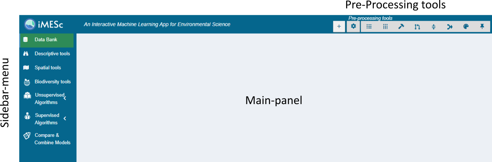

------------------------------------------------------------------------

</div>
:::

::: boxtext
# Datalist

::: {style="padding: 20px"}
[iMESc]{style="font-family: 'Alata', sans-serif;"} implements its analytic tasks on **Datalists**, which is composed of two mandatory attributes, and three optional attributes for spatializing the results:

**Required:**

-   **Numeric-Attribute:** the numeric variables. This is the attribute under which most analysis will be done.

-   **Factor-Attribute:** the categorical variables. iMESc uses it mainly for labeling, grouping and viewing the results.

**Optional:**

-   **Coords-Attribute:** the coordinates.

-   **Base-Shape:** the shape to be used to clip interpolated surfaces (e. g., an oceanic basin shape

-   **Layer-Shape:** the shape to be used to be used as an additional layer (e.g., a continent shape).

All analyses available at iMESc will require a Datalist created by the user, either [uploaded](#upload) or [using example Data](#use-example-data). Get started by [Creating a Datalist](#create-a-datalist).
:::
:::

::: boxtext
:::

------------------------------------------------------------------------

::: boxtext
# Create a Datalist {#create-a-datalist}

The button shows up a modal dialog for the creation of a Datalist. All analytical tasks in iMESc will require a Datalist created by the user, either uploaded or using example data.

## Upload {#upload}

-   **Name the Datalist:** Text widget for naming the Datalist.

-   **Numeric-Attribute**: file widget for uploading a csv file containing numeric variables. This file is required and must include observations in rows, and variables in columns. The first row must contain the variable headings, and the first column the observation labels. Columns containing characters are automatically transferred to the Factor-Attribute.


-   **Factor-Attribute:** file widget for uploading a csv file. This file must include observations in rows, and categorical variables in columns. The first row must contain the variable headings, and the first column the observation labels. Although the Factor-Attribute is mandatory in the Datalists, uploading this file is optional. However, its use is highly recommended. Throughout the application, users can use this attribute to label, group and visualize results according to the levels of a pre-selected factor. If no file is uploaded, the Factor-Attribute will only consist of the IDs (labels) from the Numeric-Attribute. This attribute can later be replaced by a new one (widget 'Replace Factor-Attribute' in button).

-   **Coords-Attribute:** file widget for uploading a csv file. This file is optional for creating a Datalist, but required for generating maps. The first column must contain the observation labels; the second the Longitude values and the third the Latitude values. The first columns must contain the coordinate headings.

-   **Base-Shape:** file widget for uploading a single R file containing the shape to be used to clip interpolated surfaces when generating maps (e. g., an oceanic basin shape). This optional file can later be created using the SHP toolbox available from button, which allow the user convert shapefiles (.shp, .shx and .dbf files) into a single R file.

-   **Layer-Shape: f**ile widget for uploading a single R file containing the shape to be used to be used as an additional layer (e.g., a continent shape) when generating maps. This optional file can later be created using the SHP toolbox available from button, which allow the user convert shapefiles (.shp, .shx and .dbf files) into a single R file.

## Best practices when uploading the CSV file

1.  Prepare your data: Use the first row as column headers, the first column as observation labels.

2.  **Each label should be unique**, so remove duplicated names. Check also for empty cells in this column.

3.  **Column names must be unique**. Duplicated names are not allowed.

4.  Avoid names with blank spaces.

5.  Avoid names with special symbols.

6.  Avoid beginning variable names with a number.

7.  R is case sensitive. This means that Name is different from Name or NAME.

8.  Avoid blank rows in your data.

9.  Replace missing values by NA (for not available).

## Use example data {#use-example-data}

This opion allows the user to insert the example data available in iMESc. When creating a Datalist, choose "use example data" from the radio-button and proceed with Datalist insertion. This single action inserts two Datalists from Araçá Bay (southeastern coast of Brazil):

-   envi_araca: 141 samples with 9 environmental variables;

-   nema_araca: 194 free-living marine nematode species (southeastern coast of Brazil).

Both Datalists carry Coords-Attribute, Base-Shape and Layer Shape.


:::

------------------------------------------------------------------------

::: boxtext
# Workflow basics

### 1. Choose a method and prepare the Datalists accordingly

-   For unsupervised methods, `X` is the Numeric Attribute.

-   For classification model, `X` is the Numeric-Attribute\* and `Y` is the Factor-Attribute. `X` and `Y` can come from the same Datalist or from different Datalists.

-   For regression models: `X` and `Y` are Numeric-Attribute, and therefore must be different Datalists

::: {style="font-size: 13px"}
*\*For the Naive Bayes Algorithm, Y is always the Factor-Attribute, and X can be either Factor-Attribute or Numeric-Attribute..*
:::

### 2. Pre-process

-   Fill in missing values, if any (Data imputation tool)

-   For distance-based methods (e.g. PCA, SOM), it may be interesting to apply some transformation.

-   For supervised methods, create a data partition in Datalist Y. This action creates a factor in the Factor-Attribute indicating the partitioning of the data into the training set and the test set.

### 3. Save changes and models

::: col-sm-12
::: col-sm-12
Saving data changes or trained models is a recurring step throughout iMESc.

After a transformation, for example, the user can save the changes as a new Datalist, or overwrite an existing one. During this process, the Factor, Coords and Shapes attributes (if any) are transferred to the new Datalist. Models saved in the Datalist (e.g. RF-Attribute) are not transferred.
:::

::: col-sm-6
The trained models are saved inside the Datalist used as a predictor (X). Likewise, the user can save as a new model, or overwrite an existing one. This action creates a new attribute within the Datalist (e.g. RF-Attribute for Random Forest models). A summary table of the different models saved in a Datalist can be viewed in the Data Bank menu.
:::

::: col-sm-6
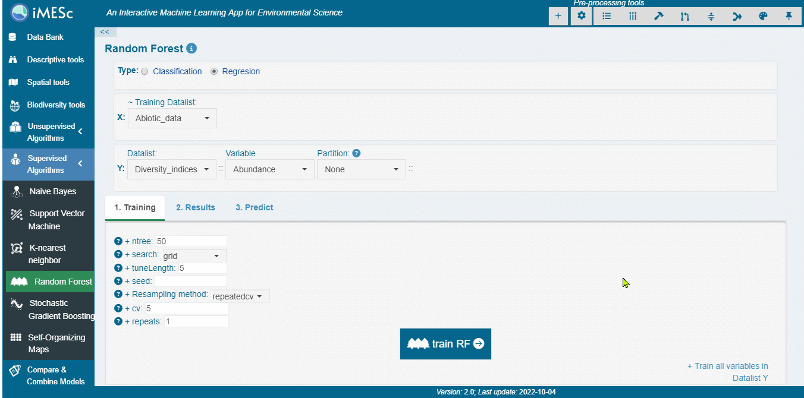
:::
:::

### 4. Download a Savepoint

Save all analysis results by creating a savepoint, a single R object that can be downloaded and reloaded later to restore analysis output.

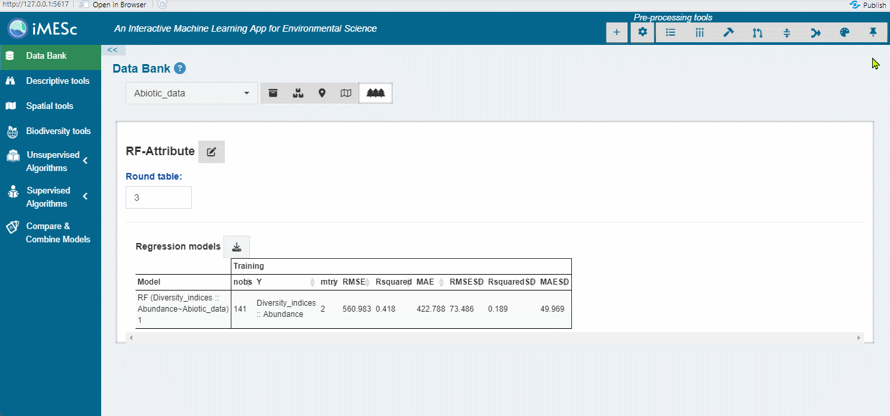
:::

------------------------------------------------------------------------

------------------------------------------------------------------------

# Pre-processing Tools {#pre-processing-tools}

::: boxtext
## {style="border: 1px solid #05668D;max-width: 44px; max-height: 31px" width="44" height="31"} Options

::: {style="padding-left: 20px"}
This drop-down button offers to the user a range of tools for editing Datalists.
:::

::: {style="display: flex"}
-   **Rename Datalist**

-   **Merge Datalist:** merge two or more Datalist by column or rows.

-   **Exchange Factor/Variables**: convert/transfer Factors to Numeric (binary or ordinal) and vice-verse.

-   **Edit Datalist Columns:** Edit the names of the columns (Numeric-Attribute and Factor-Attribute)

-   **Edit Model names:** Edit the names of the saved models.

-   **Transpose Datalist:** rotate Datalist (Numeric and Factor) from rows to columns.

-   **SHP toolbox:** creates [Base-Shapes](#Shape), [Layer-Shapes](#Shape) and [Extra-Shape](#Shape)[s](#Extra-Shape).

::: {style="width: 50%"}
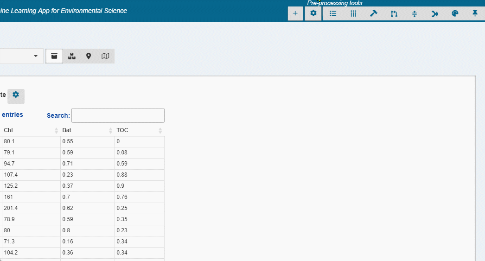
:::
:::

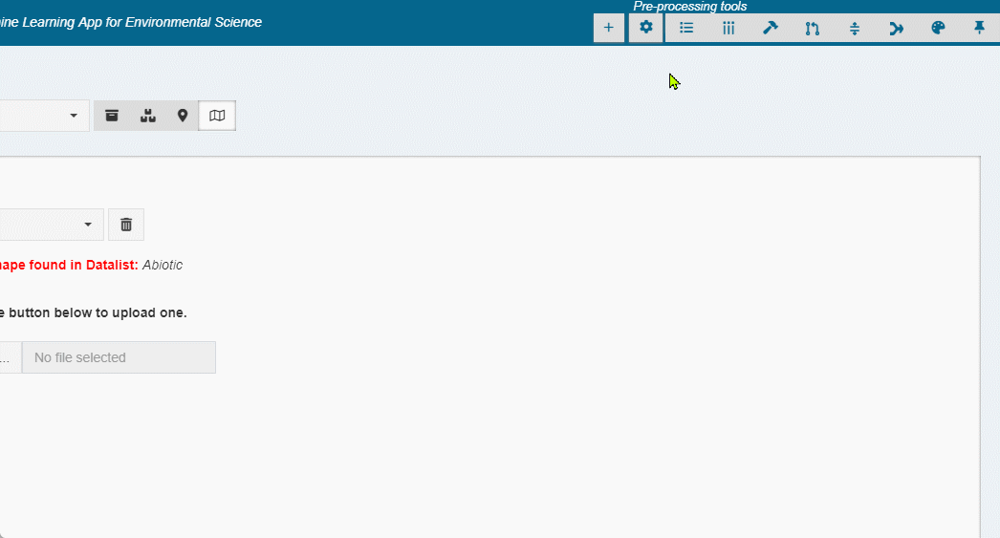{style="max-" width="50%"}
:::

------------------------------------------------------------------------

::: boxtext
## {style="max-width: 44px; max-height: 31px" width="44"} Filter observations

::: {style="padding-left: 20px; display: flex"}
-   **Na.omit**: Check-box widget to remove all observations that contain any empty cases (NAs)

-   **Match with**: If checked, constrains the target Datalist to observations (IDs) from another Datalist.

-   **Filter by Factors:** Link to display a Filter Tree structure based on the levels of the Factor-Attribute. Click in the nodes to expand and select the factor levels. Only available for factors with less than 100 levels.

-   **Individual selection:** Link to select observations using Datalist IDs.
:::


:::

------------------------------------------------------------------------

::: boxtext
## {style="border: 1px solid #05668D;max-width: 44px; max-height: 31px" width="44"} Filter variables

::: {style="padding-left:20px; display: flex"}
::: {style="width: 70%"}
-   **Value based removal**

    -   **Abund\<:** Remove variables with an value less than x-percent of the total;

    -   **Freq\<:** Remove variables occurring in less than x-percent of the number of samples;

    -   **Singletons:** Requires a counting data. Remove variables occurring only once;

-   **Individual Selection:** Link to select variables using columns names.
:::

::: {style="width: 30%"}
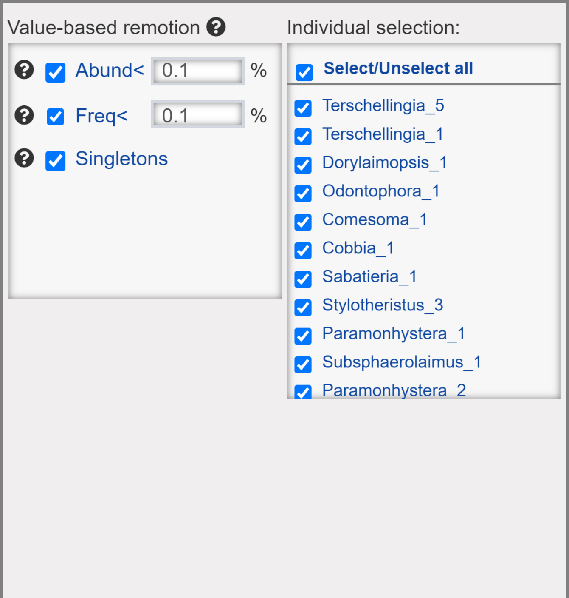
:::
:::
:::

::: boxtext
:::

------------------------------------------------------------------------

::: boxtext
## {style="border: 1px solid #05668D;max-width: 44px; max-height: 31px" width="44"} Transformations

::: {style="padding-left:20px; display: flex"}
::: {style="width: 70%"}
<div>

### Transformation

-   **None**: No Transformation

-   **Log2**: logarithmic base 2 transformation as suggested by Anderson et al. (2006): log_b (x) + 1 for x \> 0, where b is the base of the logarithm. Zeros are left as zeros. Higher bases give less weight to quantities and more to presences, and logbase = Inf gives the presence/absence scaling. Please note this is not log(x+1). Anderson et al. (2006) suggested this for their (strongly) modified Gower distance, but the standardization can be used independently of distance indices.

-   **Log10**: logarithmic base 10 transformation as suggested by Anderson et al. (2006): log_b (x) + 1 for x \> 0, where b is the base of the logarithm. Zeros are left as zeros. Higher bases give less weight to quantities and more to presences, and logbase = Inf gives the presence/absence scaling. Please note this is not log(x+1). Anderson et al. (2006) suggested this for their (strongly) modified Gower distance, but the standardization can be used independently of distance indices.

-   **Total**: divide by the line (observation) total

-   **Max**: divide by column (variable) maximum

-   **Frequency**: divide by column (variable) total and multiply by the number of non-zero items, so that the average of non-zero entries is one

-   **Range**: standardize column (variable) values into range 0 ... 1. If all values are constant, they will be transformed to 0

-   **Pa**: scale x to presence/absence scale (0/1)

-   **Chi.square**: divide by row sums and square root of column sums, and adjust for square root of matrix total

-   **Hellinger**: square root of method = total

-   **Sqrt2**: square root

-   **Sqrt4**: 4th root

-   **Log2(x+1**): logarithmic base 2 transformation (x+1)

-   **Log10(x+1)**: logarithmic base 10 transformation (x+1)

-   **BoxCox**: Designed for non-negative responses. boxcox transforms nonnormally distributed data to a set of data that has approximately normal distribution. The Box-Cox transformation is a family of power transformations.

-   **Yeojohson**: Similar to the Box-Cox model but can accommodate predictors with zero and/or negative values

-   **expoTrans**: Exponential transformation

-   **Log10**: logarithmic base 10 transformation as suggested by Anderson et al. (2006): log_b (x) + 1 for x \> 0, where b is the base of the logarithm. Zeros are left as zeros. Higher bases give less weight to quantities and more to presences, and logbase = Inf gives the presence/absence scaling. Please note this is not log(x+1). Anderson et al. (2006) suggested this for their (strongly) modified Gower distance, but the standardization can be used independently of distance indices.

-   **Total**: divide by the line (observation) total

-   **Max**: divide by column (variable) maximum

-   **Frequency**: divide by column (variable) total and multiply by the number of non-zero items, so that the average of non-zero entries is one

-   **Range**: standardize column (variable) values into range 0 ... 1. If all values are constant, they will be transformed to 0

-   **Pa**: scale x to presence/absence scale (0/1)

-   **Chi.square**: divide by row sums and square root of column sums, and adjust for square root of matrix total

-   **Hellinger**: square root of method = total

-   **Sqrt2**: square root

-   **Sqrt4**: 4th root

-   **Log2(x+1**): logarithmic base 2 transformation (x+1)

-   **Log10(x+1)**: logarithmic base 10 transformation (x+1)

-   **BoxCox**: Designed for non-negative responses. boxcox transforms nonnormally distributed data to a set of data that has approximately normal distribution. The Box-Cox transformation is a family of power transformations.

-   **Yeojohson**: Similar to the Box-Cox model but can accommodate predictors with zero and/or negative values

-   **expoTrans**: Exponential transformation

### Scale and Centering {data-link="Scale and Centering"}

-   **Scale**: If scale is checked then scaling is done by dividing the (centered) columns of x by their standard deviations if center is TRUE, and the root mean square otherwise.

-   **Center**: If center is checked then centering is done by subtracting the column means (omitting NAs) of x from their corresponding columns.

### Random Rarefraction

-   Generates one randomly rarefied community given sample size. If the sample size is equal to or larger than the observed number of individuals, the non-rarefied community will be returned

</div>
:::

::: {style="width: 30%"}
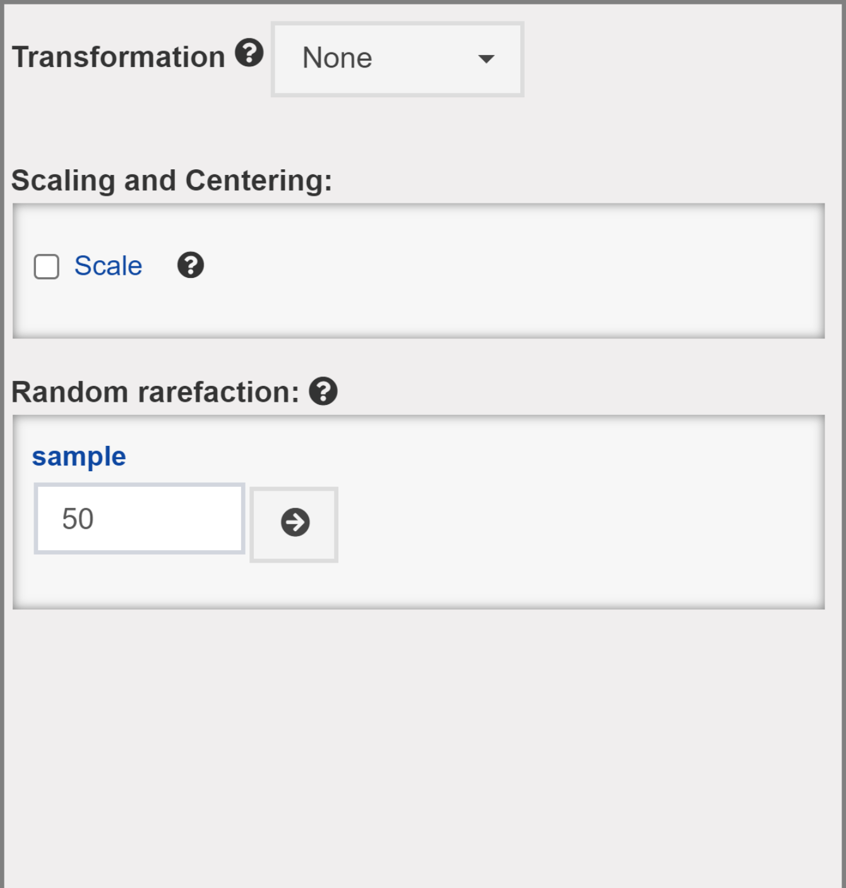
:::
:::
:::

------------------------------------------------------------------------

::: boxtext
## {style="border: 1px solid #05668D;max-width: 44px; max-height: 31px" width="44"} Data imputation

::: {.col-sm-12 style="padding-left: 20px"}
Methods for completing the missing values with values estimated from the observed data. This tool is only available for Datalists that contain missing data either in the Numeric-Attribute or in the Factor-Attribute. To impute missing values:

::: {style="col-sm-12"}
::: col-sm-4
1.  Choose the Target-Attribute;

2.  Pick a Method (described below);

3.  Click in the flash blue {style="max-width: 22px; max-height: 16px" width="22"} button. The "Save Changes" module will automatically pop-up

4.  Save the Datalist with imputed values as a new Datalist or replace an existing one.
:::

::: col-sm-8
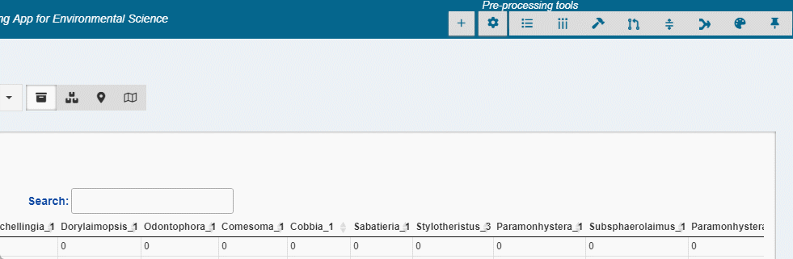
:::
:::
:::

::: col-sm-12
**Methods:**

-   **Median/mode:** Numeric-Attribute columns are imputed with the median; Factor-Attribute columns are imputed with the mode

-   **Knn**: k-nearest neighbor imputation is only available for the Numeric-Attribute. It is carried out by finding the k closest samples (Euclidian distance) in the dataset. This method automatically center and scale your data.

-   **Baginpute**: Only available for the Numeric-Attribute. Imputation via bagging fits a bagged tree model for each predictor (as a function of all the others). This method is simple, accurate and accepts missing values, but it has much higher computational cost.

-   **MedianImpute**: Only available for the Numeric-Attribute. Imputation via medians takes the median of each predictor in the training set, and uses them to fill missing values. This method is simple, fast, and accepts missing values, but treats each predictor independently, and may be inaccurate.
:::
:::

------------------------------------------------------------------------

::: boxtext
## 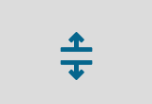{style="border: 1px solid #05668D;max-width: 44px; max-height: 31px" width="44"} Data partition

::: {style="padding: 20px; display: flex"}
::: {style="width: 70%"}
Add partition as a factor in the Factor-Attribute. For the supervised ML methods, you can choose this partition to constrain training and testing data.

-   **Random Sampling:** simple random sampling is used

-   **Balanced Sampling:** The random sampling is done within the levels of a choosen factor in an attempt to balance the class distributions within the splits.
:::

::: {style="width:50%"}
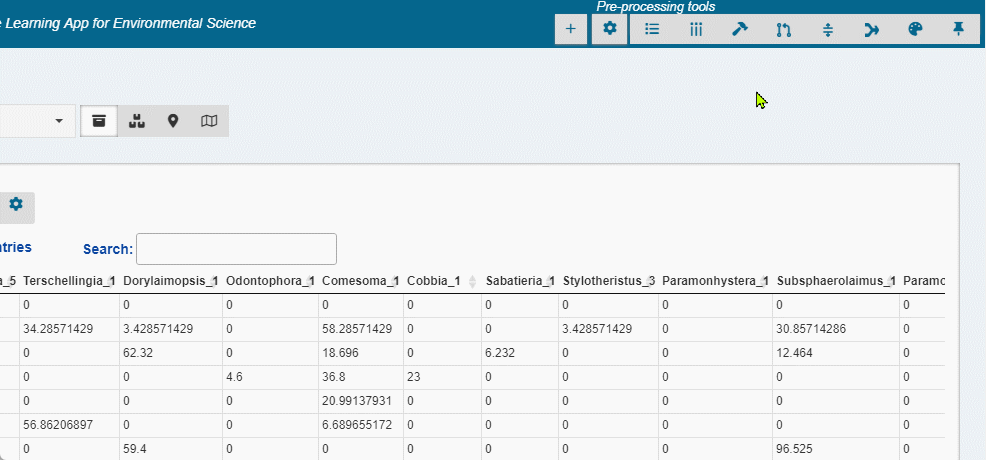
:::
:::

::: boxtext
In the context of Machine Learning, the split of the modelling dataset into training and testing samples is probably one of the most common pre-processing steps that is needed to undertake. The creation of different samples for training and testing helps the model evaluation.
:::
:::

------------------------------------------------------------------------

::: boxtext
## {style="border: 1px solid #05668D;max-width: 44px; max-height: 31px" width="44"} Aggregate

::: {style="padding-left: 20px; display: flex"}
::: {style="width: 70%"}
::: {style="padding: 20px"}
The process involves two stages. First, collate individual cases of the Numeric-Attribute together with a grouping variable (unselected factors). Second, perform which calculation you want on each group of cases (selected factors). Available methods includes *Mean*, *Sum*, *Median*, *Var* (variance), *SD* (standard deviation), *Min*, *Max.*
:::
:::

::: {style="width: 100%"}
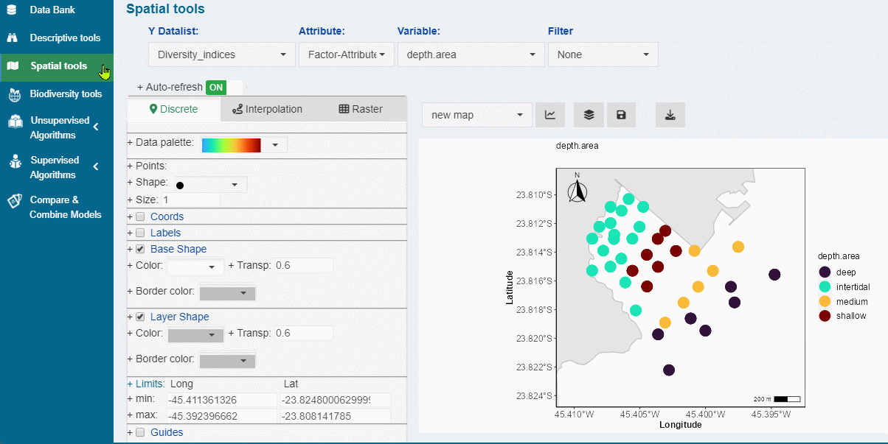
:::
:::
:::

------------------------------------------------------------------------

::: boxtext
## {style="border: 1px solid #05668D;max-width: 44px; max-height: 31px" width="44"} Create Palette

::: {style="padding-left: 20px; display: flex"}
::: {style="width: 70%"}
Create customized palettes to be used along the graphical outputs.
:::

::: {style="width: 40%"}
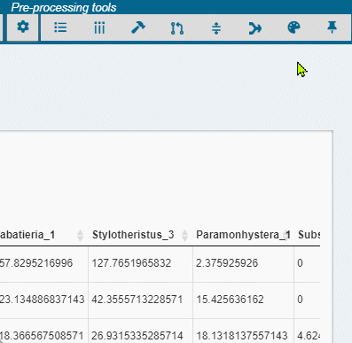
:::
:::
:::

------------------------------------------------------------------------

::: boxtext
## {style="border: 1px solid #05668D;max-width: 44px; max-height: 31px" width="44"} Savepoint

::: {style="padding-left: 20px; display: flex"}
::: {style="width: 70%"}
-   **Create**: create a savepoint, a single R object to be downloaded and that can be reloaded later to restore analysis output.

-   **Restore** : Upload a savepoint (.rds file) to restore the dashboard.
:::

::: {style="width: 30%"}
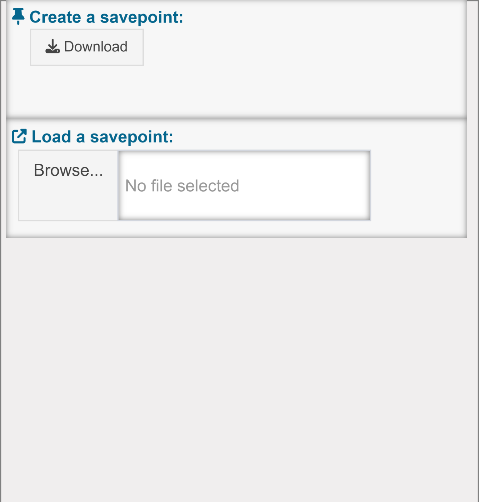
:::
:::
:::

------------------------------------------------------------------------

::: boxtext
## Track changes

<div>

This group of panels shows up when using the functionalities provided by {style="max-width: 29px; max-height: 20px" width="29"}{style="max-width: 29px; max-height: 20px" width="29"}{style="max-width: 29px; max-height: 20px" width="29"}{style="max-width: 29px; max-height: 20px" width="29"}{style="max-width: 29px; max-height: 20px" width="29"}{style="max-width: 29px; max-height: 20px" width="29"}. The user can track changes in real-time via summary panels and histograms. We highlight the *Missing values* panel for checking the number of missing values per variable.

::: {style="display: flex"}
::: {style="width: 50%"}
-   **Changes**: displays current and previous changes (see existing)

-   **Summary**: displays the number of missing values, rows and columns; and minimum, average, median, and maximum values.

-   **Data**: Histogram of all numerical values

-   **colSums**: Column sum histogram

-   **rowSums**: row sum historam

-   **Missing values**: number of missing values per variable.
:::

::: {style="width: 50%"}
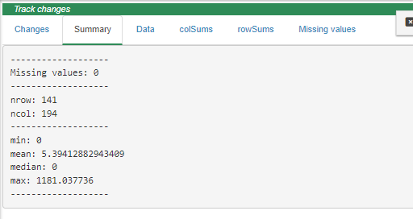
:::
:::

</div>
:::

# Sidebar-menu

::: boxtext
## {style="max-width: 54px; max-height: 30px" width="54"} Data Bank

::: {style="display: flex"}
::: {style="padding-left: 20px"}
{style="max-width: 54px; max-height: 30px" width="54"} **Datalist-Picker:** Drop-down selector of the target Datalist

{style="max-width: 54px; max-height: 30px" width="54"} **Numeric-Attribute:** shows the Numeric-Attribute sheet

{style="max-width: 54px; max-height: 30px" width="54"} **Factor-Attribute:** shows the Factor-Attribute sheet

{style="max-width: 54px; max-height: 30px" width="54"} **Coords-Attribute:** shows the Coords-Attribute sheet

{style="max-width: 54px; max-height: 30px" width="54"} [**Shapes**]{#Shape}**:**

-   [*Base-Shape:*]{#Base-Shape} the shape to be used to clip interpolated surfaces (e. g., an oceanic basin shape) ;

-   [*Layer-Shape:*]{#Layer-Shape}the shape to be used to be used as an additional layer (e.g., a continent shape);

-   [*Extra-Shapes:*]{#Extra-Shape}Any additional shapes to be included in the Datalist (e.g. bathymetry lines).
:::

::: {style="max-width: 50%"}
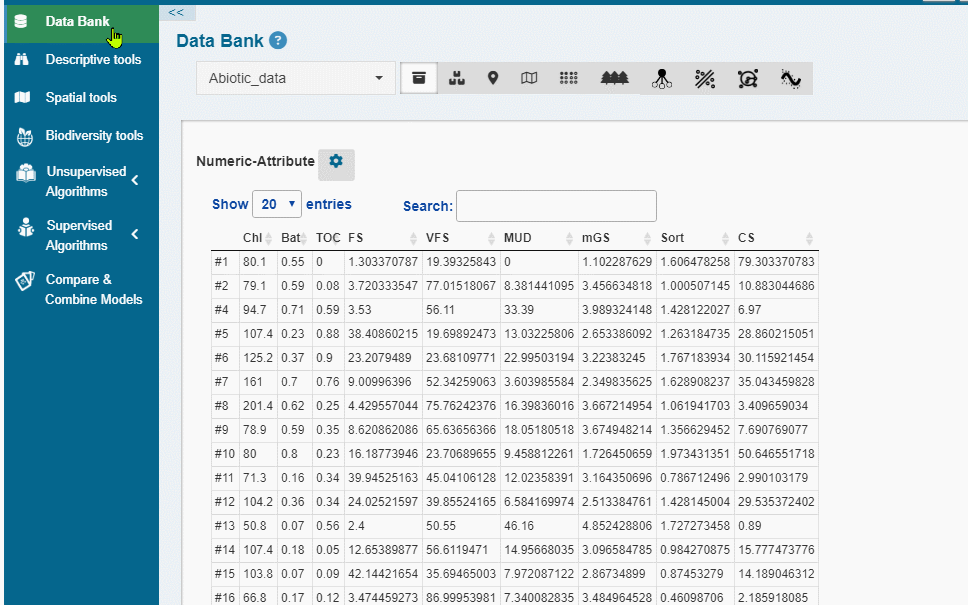
:::
:::

::: {style="padding-left: 20px"}
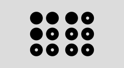{style="max-width: 54px; max-height: 30px" width="54"} **SOM-Attribute:** displays the summary of SOM models ([unsupervised](#self-organizing-maps) and [supervised](#self-organizing-maps-1)) (if saved in the target Datalist).

{style="max-width: 54px; max-height: 30px" width="54"} **NB-Attribute:** displays the summary of [NB models](#naive-bayes)

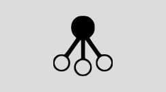{style="max-width: 54px; max-height: 30px" width="54"} **KNN-Attribute:** displays the summary of [KNN models](#k-nearest-neighbor)

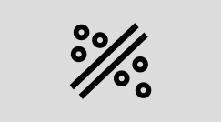{style="max-width: 54px; max-height: 30px" width="54"} **SVM-Attribute:** displays the summary of [SVM models](#support-machine-vector)

{style="max-width: 54px; max-height: 30px" width="54"} **RF-Attribute:** displays the summary of [RF models](#random-forest)

{style="max-width: 54px; max-height: 30px" width="54"} **SGBOOST -Attribute:** displays the summary of [SGBOOST models](#stochastic-gradient-boosting)
:::
:::

## {style="max-width: 54px; max-height: 30px" width="54"} Descriptive tools

### Summary

::: {style="display: flex"}
::: {style="max-width: 30%"}
-   **Data**: shows number of rows, columns and missing values of the Numeric-Attribute;

-   **Variable**: shows summary and a histogram for each variable in the Numeric-Attribute;

-   **Factors**: shows a summary of the Factor-Attribute and box-plot with the count of the Factors levels;

-   **Datalist**: shows the Datalist structure.
:::

<div>

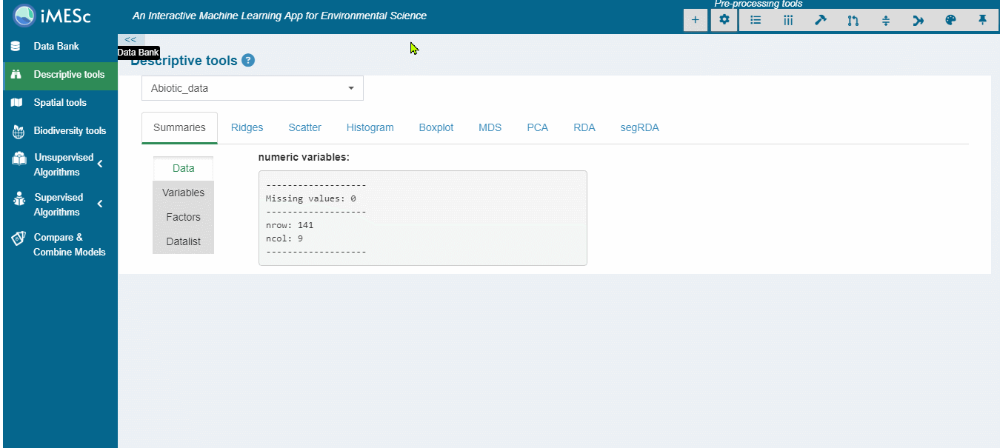{style="padding: 20px"}

</div>
:::

### Ridges

::: {style="display: flex"}
::: {style="max-width: 30%"}
-   Ridge plots are partially overlapping line plots that create the impression of a mountain range. They can be quite useful for visualizing changes in distributions over time or space. This function uses the [geom_ridgeline](https://rdrr.io/cran/ggridges/man/geom_ridgeline.html) function from the [ggridges](https://rdrr.io/cran/ggridges/) package.
:::

<div>

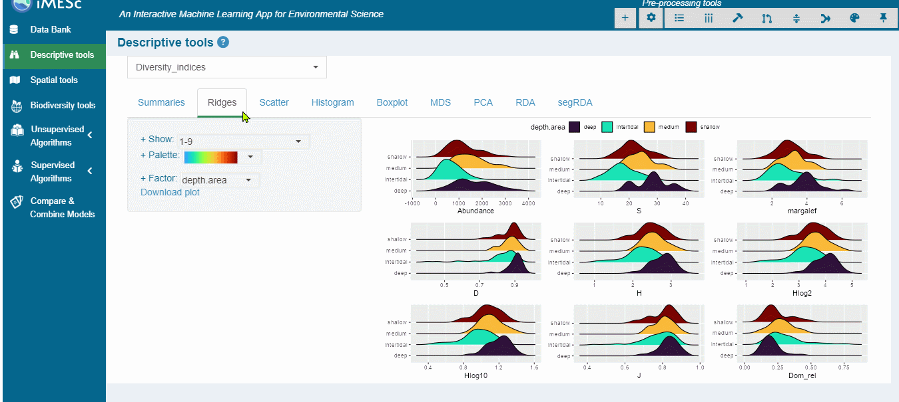{style="padding: 20px"}

</div>
:::

### Scatter

::: {style="display: flex"}
::: {style="max-width: 30%"}
-   A graph in which the values of two variables are plotted along two axes, the pattern of the resulting points revealing any correlation present.;
:::

<div>

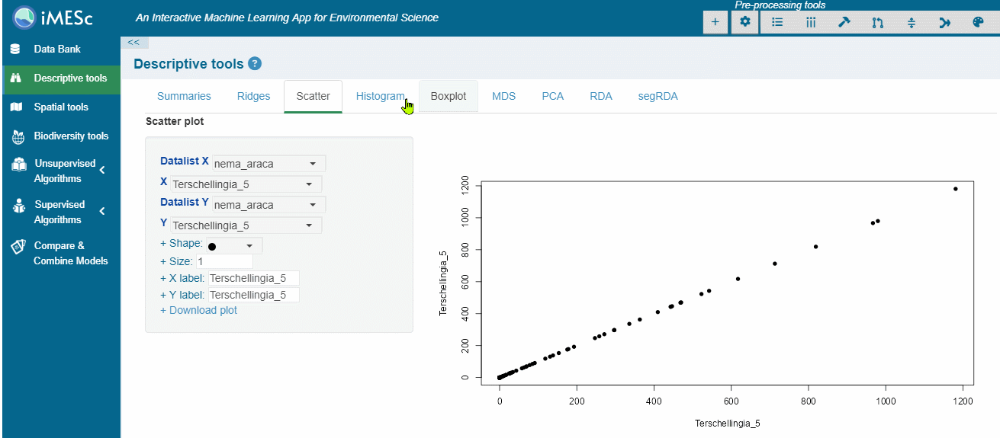{style="padding: 20px"}

</div>
:::

### Histogram

-   Numeric-Attribute column sum histogram

### Boxplot

::: {style="display: flex"}
::: {style="min-width: 30%"}
-   Boxplot with numerous graphical options
:::

<div>

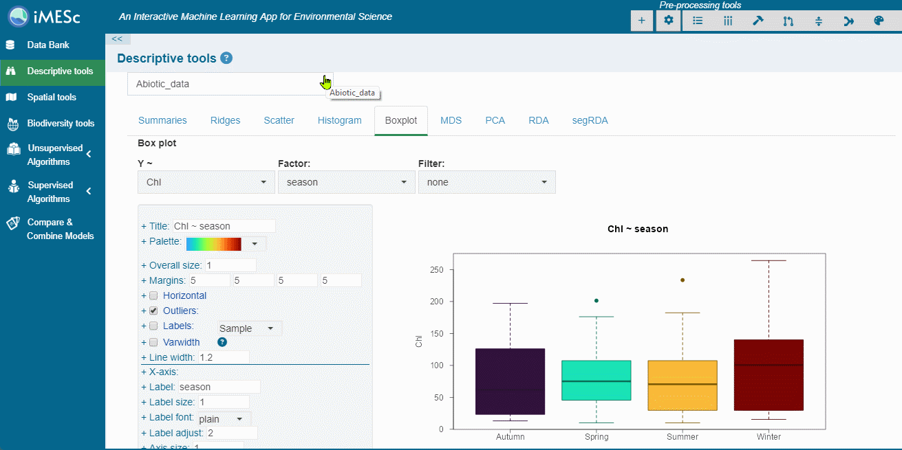{style="padding: 20px"}

</div>
:::

### Histogram

-   Numeric-Attribute column sum histogram

### MDS

::: {style="display: flex"}
::: {style="max-width: 30%"}
-   Nonmetric Multidimensional Scaling. This functionality uses the [metaMDS](https://rdrr.io/rforge/vegan/man/metaMDS.html) function from [vegan](https://rdrr.io/rforge/vegan/) package. It uses default arguments, with user option to choose the distance metric (Bray-Curtis, Euclidean and Jacquard). The user can interact with several graphical options, including coloring observations by a factor from the associated Factor-Attribute.
:::

<div>

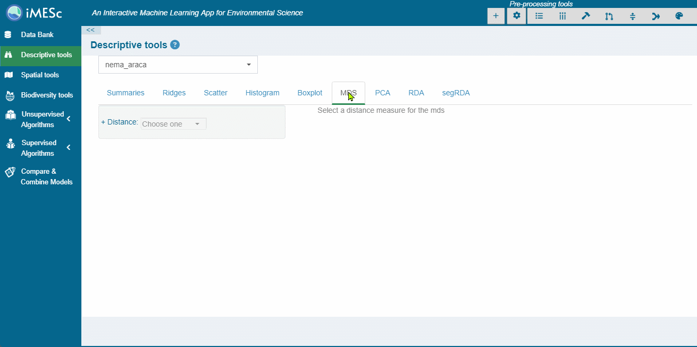{style="padding: 20px"}

</div>
:::

### PCA

::: {style="display: flex"}
::: {style="max-width: 30%"}
-   Principal Component Analysis. This functionality uses the [prcomp](https://www.rdocumentation.org/packages/stats/versions/3.6.2/topics/prcomp) function from R base. We recommend scaling the data before the PCA analysis ([S]). The user can interact with several graphical options, including coloring observations by a factor from the associated Factor-Attribute.
:::

<div>

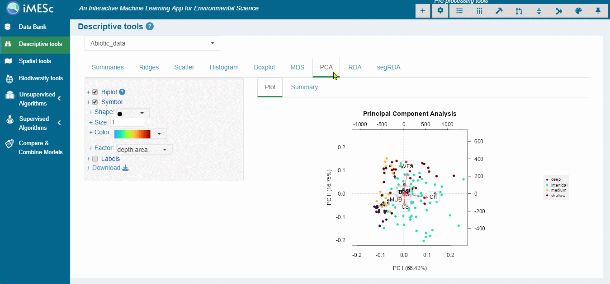{style="padding: 20px"}

</div>
:::

### RDA

::: {style="display: flex"}
::: {style="max-width: 30%"}
Redundancy Analysis. This functionality uses the [rda](https://www.rdocumentation.org/packages/vegan/versions/2.4-2/topics/cca) function from from [vegan](https://rdrr.io/rforge/vegan/) package. It requires at least two Datalist for building a Y\~X model. The results are presented in two panels:

-   Plot with with several graphical options, such as coloring observations by a factor from the associated Factor-Attribute.

-   Summary: results of the rda model- importance (constrained and unconstrained), variable and observation scores, linear constrains and biplot.
:::

<div>

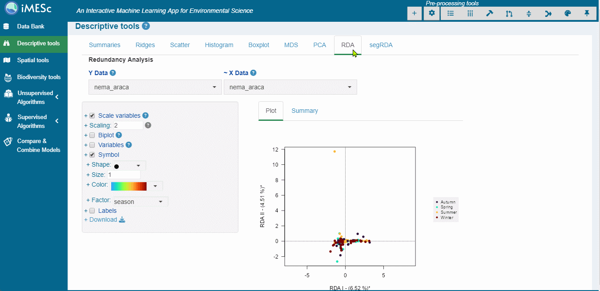{style="padding: 20px"}

</div>
:::

### segRDA

::: {style="display: flex"}
::: {style="max-width: 30%"}
This functionality implements the [segRDA](https://besjournals.onlinelibrary.wiley.com/doi/full/10.1111/2041-210x.13300) workflow for modelling non-continuous linear responses of ecological data. The routine consists of three panels:

-   SMW - Split Moving Windows along ordered data

-   DP: dissimilarity profile of the SMW results for identifying breakpoints

-   pwRDA: performs a piece-wise redundancy analysis using specified breakpoints. The results are presented in the same way as in the [R] panel.
:::

<div>

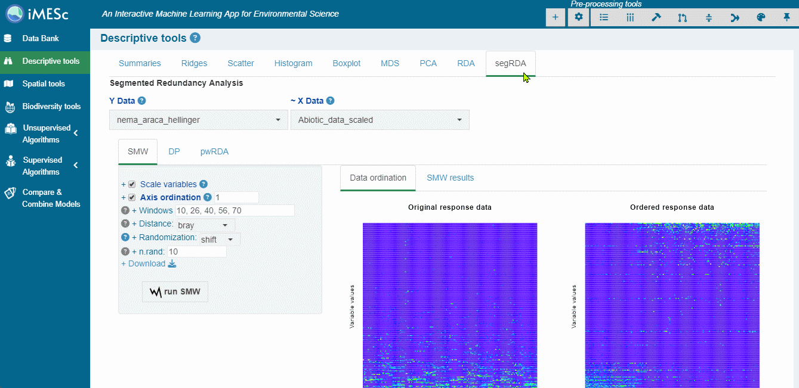{style="padding: 20px"}

</div>
:::

::: boxtext
## {style="max-width: 54px; max-height: 30px" width="54"} Spatial Tools

This module is intended for spatialization and therefore requires the Coors-Attributes attached to the chosen Datalist.

After choosing a Datalist, choose the Attribute (Numeric or Variable) and then the target: Numeric/Factor. Optionally, filters can be applied to plot observations corresponding to a chosen factor level.

Map types include discretization (2D, 3D, 4D), interpolation (2D, Surface and Stack), and rasterization (2D, Surface and Stack). A wide range of customization options is available for all map types.

### Discrete

Variable/factor are represented as symbols in the map. When target is the Numeric-Attribute, it is available the scale option (default), where the chosen symbol is represented as a point that varies on size and color according to the target data. Alternatively, points can be colored according to a selected factor.

The 3D/4D option is also available for this type of maps. In this option, the target variable is plotted along a Z variable, which in turn can be colored by a selected factor.

In the discrete map type, the Mantel correlogram is also available.

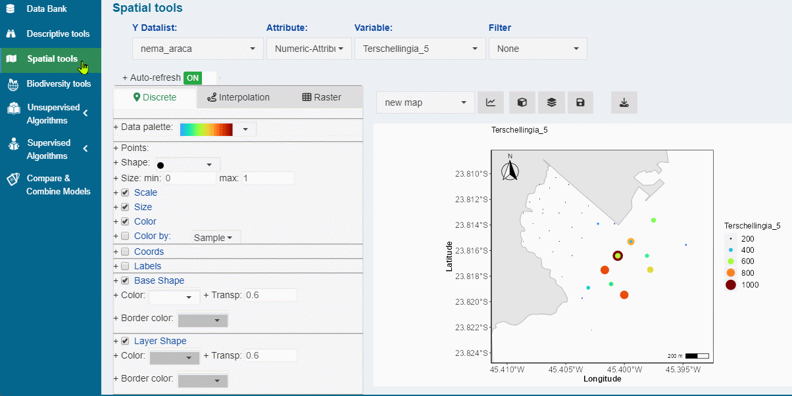

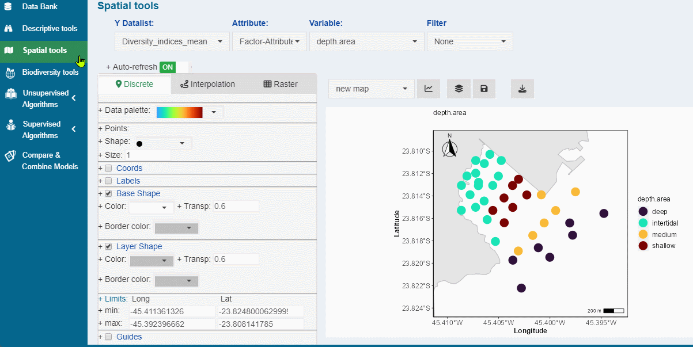

### Interpolation

Variable/factor are represented as interpolated surface. When mapping the Numeric Attribute, the interpolation is performed using Inverse Distance Weighing (IDW), while for the Factor Attribute, it is performed using k-nearest neighbors (KNN). For both interpolation types, it is available tuning parameters.

### Raster

Mapping is performed by simple rasterization at the coordinates resolution. This options is only available for mapping Numeric-Attribute.

### Surface and Stack

These map types are available for Interpolated/Rasterized maps. Both options require at least two saved maps.

-   The surface maps draws a perspective plot of a surface over the coordinates plane. The surface passes through the z values corresponding to all pairs of coordinates. Additionally, The surface can be colored according to a selected factor (4D).

-   The stacked map combines multipe interploated/rasterized planes (for a common geographic area) to represent a integrated map. The collection of saved maps acts as layers in the stack, and their position along the z axis can be defined by the user.
:::

::: {style="padding-left: 20px"}

-   Size: the symbol size;

    -   when target is Numeric

    <!-- -->

        -   Min: minimum size when scaling the target variable

        -   Max: maximum size when scaling the target variable

-   Scale (when target is Numeric)

    -   Size: if checked, the smallest value in the variable is mapped to a size of 'Min' and the largest is mapped to a size of 'Max'. If not, no scaling is applied

    -   Color: if checked, the smallest and highest value in the variable is colored according to the chosen palette.

-   Color by

    -   Factor

-   Coords

    -   Color

    -   Size

-   Labels

    -   Factor

    -   Color

    -   Size

-   Base Shape

    -   Color

    -   Transp

    -   Border color

-   Layer Shape

    -   Color

    -   Transp

    -   Border color

::: {style="padding-left: 20px"}
Header:

-   **Y Datalist**: drop-down selector of the target Datalist

-   **Attribute**: Numeric or Factor-Atribute

-   **Variable**: the Variable/Factor to plot

-   **Filter**: constrain observations to a factor level

-   **Level**: if 'Filter' is not "none", the level to constrain the observations.

Discrete

Plain

3d

Stacked 3d

Interpolation

Plain

Surface

Stacked 3d

Raster

Plain

Surface

Stacked 3d
:::
:::

::: boxtext
## {style="max-width: 54px; max-height: 30px" width="54"} Biodiversity Tools

under construction............

::: {style="padding-left: 20px"}
Diversity Indexes

Niche
:::
:::

::: boxtext
## {style="max-width: 54px; max-height: 30px" width="54"} Unsupervised Algorithms

under construction............

::: {style="padding-left: 20px"}
## {style="max-width: 54px; max-height: 30px" width="54"} Self-Organizing maps {#self-organizing-maps}

under construction............

## {style="max-width: 54px; max-height: 30px" width="54"} Hierarchical clustering

under construction............

## {style="max-width: 54px; max-height: 30px" width="54"} K-means

under construction............
:::
:::

::: {style="boxtext"}
## {style="max-width: 54px; max-height: 30px" width="54"} Supervised Algorithms

::: {style="padding-left: 20px"}
## {style="max-width: 54px; max-height: 30px" width="54"} Naive Bayes {#naive-bayes}

under construction............

## {style="max-width: 54px; max-height: 30px" width="54"} Support Machine Vector {#support-machine-vector}

under construction............

## {style="max-width: 54px; max-height: 30px" width="54"} K-Nearest neighbor {#k-nearest-neighbor}

under construction............

## {style="max-width: 54px; max-height: 30px" width="54"} Random Forest {#random-forest}

under construction............

## {style="max-width: 54px; max-height: 30px" width="54"} Stochastic Gradient Boosting {#stochastic-gradient-boosting}

under construction............

## {style="max-width: 54px; max-height: 30px" width="54"} Self-Organizing Maps {#self-organizing-maps-1}

under construction............
:::
:::

::: boxtext
## {style="max-width: 54px; max-height: 30px" width="54"} Compare and Combine Models

under construction............

::: {style="padding: 20px"}
Compare

Combine
:::
:::

# Workflow examples

under construction............
