```{r, include = FALSE}
knitr::opts_chunk$set(echo = TRUE,
  collapse = TRUE,
  comment = "#>"
)
```

```{r setup, echo=F}
#library(shiny)
#library(shinyWidgets)
#library(shinyBS)
#library(fontawesome)
```

<head>
 <script type="text/javascript"
            src="http://cdn.mathjax.org/mathjax/latest/MathJax.js?config=TeX-AMS-MML_HTMLorMML">
    </script>
</head>


This tutorial is under construction yet....

# Introduction

**\
**[iMESc]{style="font-family: 'Alata', sans-serif;"} is a shiny-based application that allows the performance of end-to-end machine learning workflows. The available resources meet several needs of environmental workflows, but it is not restricted to. [iMESc]{style="font-family: 'Alata', sans-serif;"} includes tools for data pre-processing, to perform descriptive statistics, supervised and unsupervised machine learning algorithms and interactive data visualization by means of graphs, maps, and tables. Throughout the app, data input and output are organized in modules enabling the creation of multiple ML pipelines. Additionally, it allows saving the workspace in a single file, contributing to the best practices in data-sharing and analysis reproducibility. The app is entirely written in the R programming language and thus it is free.

# Setup

::: numbold
1.  Install [R](https://cran.r-project.org/) and [RStudio](https://www.rstudio.com/products/rstudio/download/) if you haven't done so already;

2.  Once installed, open R studio;

3.  Install shiny package if it is not already installed;
:::

```{r cars, eval=F}
install.packages('shiny')
```

4.  ::: numbold
    Run the code below.
    :::

```{r  eval=F}
shiny::runGitHub('iMESc','DaniloCVieira', ref='main')
```

The app will automatically install the required packages and may take some time if this is your first time using the application. The next time, it shouldn't take more than a few seconds.

# Layout

<div>

[iMESc]{style="font-family: 'Alata', sans-serif;"} is organized through a dashboard layout, with the main page split into three sections: **(1) Pre-processing tools** on the top-left containing [widgets](#widgets) for Datalist options and pre-processing data; **(2) Sidebar-menu** on the left containing menu buttons; and the **(3) main panel** for analytical tasks. When selecting menu button, the user will be taken to a subscreen (module). Each module has a header containing interaction widgets and multiple tab panels supporting their of functionalities. To ensure that iMESc content fits nicely on the screen, we recommend a landscape minimum resolution of 1377 x 768 pixels.


</div>

# Widgets {#widgets}

The app is built using widgets: web elements that users can interact with. The standard [iMESc]{style="font-family: 'Alata', sans-serif;"} widgets are:

+-----------------+-----------------------------------------------------------------------------------------------+------------------------------------------+
| Widgets         | Task                                                                                          |                                          |
+=================+===============================================================================================+==========================================+
| Button          | Performs an action when clicked                                                               | 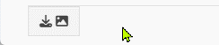{width="286"}     |
+-----------------+-----------------------------------------------------------------------------------------------+------------------------------------------+
| Picker/Dropdown | Allows the user to select only one of a predefined set of mutually exclusive options          | 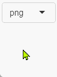{width="67"}      |
+-----------------+-----------------------------------------------------------------------------------------------+------------------------------------------+
| Checkbox        | Interactive box that can be toggled by the user to indicate an affirmative or negative choice | 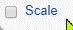{width="49"}       |
+-----------------+-----------------------------------------------------------------------------------------------+------------------------------------------+
| Checkbox group  | A group of check boxes                                                                        | 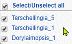{width="115"} |
+-----------------+-----------------------------------------------------------------------------------------------+------------------------------------------+
| Radiobuttons    | Allows the user to choose only one of a predefined set of mutually exclusive options          | 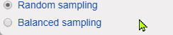{width="366"}      |
+-----------------+-----------------------------------------------------------------------------------------------+------------------------------------------+
| File            | A file upload control wizard                                                                  | {width="328"}       |
+-----------------+-----------------------------------------------------------------------------------------------+------------------------------------------+
| Numeric         | A field to enter numbers                                                                      | 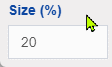{width="90"}         |
+-----------------+-----------------------------------------------------------------------------------------------+------------------------------------------+
| Text            | A field to enter text                                                                         | {width="110"}       |
+-----------------+-----------------------------------------------------------------------------------------------+------------------------------------------+

# Datalist

::: {style="padding: 20px"}
[iMESc]{style="font-family: 'Alata', sans-serif;"} handles data as **Datalists**, which is composed of two mandatory attributes, and three optional attributes. All the attributes have to be organized with observation as rows and variables as columns. If more than one attribute is used, it is important to format them with the same observation IDs

**Required:**

-   **Numeric-Attribute**: the numeric variables. This is the attribute under which most analysis is done.

-   **Factor-Attribute:** the categorical variables. [iMESc]{style="font-family: 'Alata', sans-serif;"} uses it mainly for labeling, grouping, and viewing the results. If this file is not provided by the user, the Factor-Attribute will only consist of the IDs (labels) from the Numeric-Attribute

**Optional:**

-   **Coords-Attribute:** the geographical coordinates (decimal degrees). Longitude has to be in the first column, while Latitude in the second.

-   **Base-Shape:** the shape to be used to clip the geographic area (e. g., an oceanic basin shape).

-   **Layer-Shape:** the shape to be used to be used as an additional layer (e.g., a continent shape).

All analyses available at iMESc will require a Datalist created by the user, either [uploaded](#upload) or [using example Data](#use-example-data). Get started by [Creating a Datalist](#create-a-datalist).
:::

# Create a Datalist {#create-a-datalist}

The button shows up a modal dialog for the creation of a Datalist. All analytical tasks in iMESc will require a Datalist created by the user, either uploaded or using example data.

## Upload {#upload}

-   **Name the Datalist:** text widget for naming the Datalist.

-   **Numeric-Attribute**: file widget for uploading a *.csv* file containing numeric variables. This file is required and must include observations as rows and variables as columns. The first row must contain the variable headings, and the first column the observation labels. Columns containing characters (text or mixed numeric and non-numeric values) are automatically transferred to the Factor-Attribute.

{.pause-gif}

-   **Factor-Attribute:** file widget for uploading a csv file. This file must include observations as rows, and categorical variables as columns. The first row must contain the variable headings, and the first column the observation labels. Although the Factor-Attribute is mandatory in the Datalists, uploading this file is optional. However, its use is highly recommended. Throughout the application, users can use this attribute to label, group and visualize results according to the levels of a pre-selected factor. If no file is uploaded, the Factor-Attribute will only consist of the IDs (labels) from the Numeric-Attribute. This attribute can later be replaced by a new one (widget 'Replace Factor-Attribute' button)

-   **Coords-Attribute:** file widget for uploading a .csv file. This file is optional for creating a Datalist but required for generating maps. The first column must contain the observation labels; the second the Longitude values and the third the Latitude values (both in decimal degrees). The first row must contain the coordinate headings.

-   **Base-Shape:** file widget for uploading a single R file containing the shape to be used to generate maps (e. g., an oceanic basin shape) and, if desired, create interpolated surfaces. This optional file can later be created using the SHP toolbox available in the pre-processing tools, which allow the user convert shapefiles (.shp, .shx and .dbf files) into a single R file.

-   **Layer-Shape:** file widget for uploading a single R file containing the shape to be used to be used as an additional layer (e.g., a continent shape) when generating maps. This optional file can later be created using the SHP toolbox available in the pre-processing tools, which allow the user convert shapefiles (.shp, .shx and .dbf files) into a single R file.

## Best practices when uploading the CSV file

1.  Prepare your data: Use the first row as column headers, the first column as observation labels.

2.  Each label should be filled with information and unique, so remove duplicated names. Check also for empty cells in this column.

3.  Column names must also be unique. Duplicated names are not allowed.

4.  Avoid names with blank spaces.

5.  Avoid names with special symbols.

6.  Avoid beginning variable names with a number.

7.  R is case sensitive. This means that "name" is different from "Name" or "NAME".

8.  Avoid blank rows and columns in your data.

9.  Replace missing values by NA (for not available).

## Use example data {#use-example-data}

This option allows the user to insert the example data available in iMESc. When creating a Datalist, choose "use example data" from the radio-button and proceed with Datalist insertion. This single action inserts two Datalists from the Araçá Bay (southeastern coast of Brazil):

-   envi_araca: 141 samples with 9 environmental variables.

-   nema_araca: 141 samples with 194 free-living marine nematode species (southeastern coast of Brazil).

Both Datalists carry four attributes: Factors, Coords-Attribute, Base-Shape and Layer Shape.


# Workflow basics

## 1. Choose a method and prepare the Datalists accordingly

-   For unsupervised methods, *X* is the Numeric Attribute.

-   For classification model, *X* is the Numeric-Attribute\* and *Y* is the Factor-Attribute. *X* and *Y* can come from the same Datalist or from different Datalists.

-   For regression models: *X* and *Y* are Numeric-Attribute, and therefore must be from different Datalists

::: {style="font-size: 13px"}
*\*For the Naive Bayes Algorithm, Y is always the Factor-Attribute, and X can be either Factor-Attribute or Numeric-Attribute.*
:::

## 2. Pre-process

-   Fill in missing values, if any (Data imputation tool)

-   For distance-based methods (e.g., PCA, SOM), it may be interesting to apply some transformation (e.g., scale, center, log).

-   For supervised methods, create a data partition in Datalist Y. This action creates a column in the Factor-Attribute indicating the partitioning of the data into the training set and the test set.

## 3. Save changes and models

Saving data changes or trained models is a recurring step throughout iMESc.

After a transformation, for example, the user can save the changes as a new Datalist or overwrite an existing one. During this process, the Factor, Coords and Shapes attributes (if any) are transferred to the new Datalist. Models previously saved in a Datalist (e.g., RF-Attribute) are not transferred to the newer version.

The trained models are saved in the Datalist used as a predictor (X). Likewise, after training the user can save it as a new model or overwrite an existing one. This action creates a new attribute within the Datalist (e.g., RF-Attribute for Random Forest models). A summary table of the different models saved in a Datalist can be viewed in the Data Bank menu.


## 4. Download a Savepoint

Save the workspace by creating a Savepoint. This file is a single R object that can be downloaded and reloaded later to restore all the files and analysis outputs.


# Datalist options

## {style="border: 1px solid #05668D;max-width: 44px; max-height: 31px" width="40"} Options

This drop-down menu offers to the user a range of tools for editing Datalists.

### Rename Datalist

Rename a target Datalist

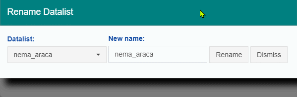{width="400"}

### Merge Datalist

Merge two or more Datalist by column or rows. This action affects both Numeric and Factor-Attribute. If the merge is by rows, it also affects the Coords-Attribute. Saved models are not transferred.

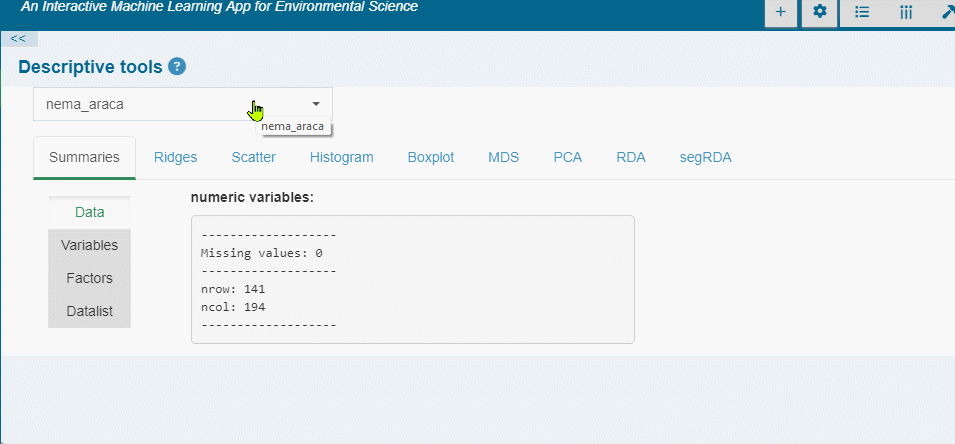{width="752"}

### Exchange Factor/Variables

Convert/transfer Factors to Numeric (binary or ordinal) and vice-verse.

+------------------+--------------------------------------------------------------------------------------------------------------------------+----------------------------------------------------------------------------------------------------------------------------------------------------------------------------------------------+
|                  | To Numeric                                                                                                               | To Factor                                                                                                                                                                                    |
+==================+==========================================================================================================================+==============================================================================================================================================================================================+
| **From Numeric** | ::: ctab                                                                                                                 | Converts the selected numeric variables to factors. The option 'cut' breaks the variable (s) in bins to categorize it as the specified number of classes (levels). If cut is unchecked, then |
|                  | Copy/transfer the selected variables from one Datalist to another                                                        |                                                                                                                                                                                              |
|                  | :::                                                                                                                      | each unique value will become a level.                                                                                                                                                       |
|                  |                                                                                                                          |                                                                                                                                                                                              |
|                  |                                                                                                                          | In both cases, the user can edit the names and order of the factor levels. For reordering, drag and drop the levels to define their values.                                                  |
+------------------+--------------------------------------------------------------------------------------------------------------------------+----------------------------------------------------------------------------------------------------------------------------------------------------------------------------------------------+
| **To Factor**    | Converts the selected factors to numeric data before copying/moving. Two types of conversions are available:             | ::: ctab                                                                                                                                                                                     |
|                  |                                                                                                                          | Copy/transfer the selected factors from one Datalist to another.                                                                                                                             |
|                  | -   Binary: Creates a single binary column per factor level, with 1 indicating the class of that particular observation. | :::                                                                                                                                                                                          |
|                  |                                                                                                                          |                                                                                                                                                                                              |
|                  | -   Integer: Creates a single column using numeric (integer) representation (values) of the factor levels                |                                                                                                                                                                                              |
+------------------+--------------------------------------------------------------------------------------------------------------------------+----------------------------------------------------------------------------------------------------------------------------------------------------------------------------------------------+

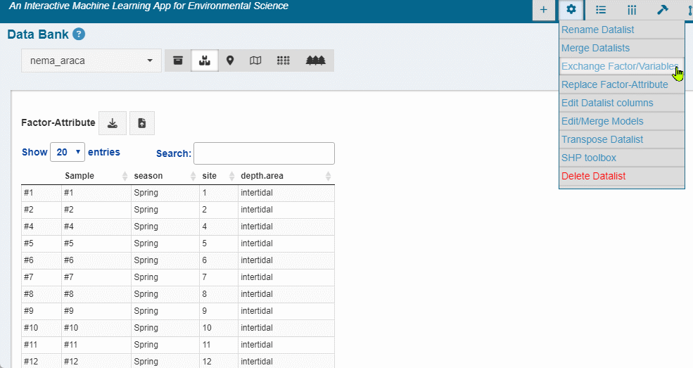{width="753"}

{width="742"}

### Replace Factor-Attribute

Replace the Factor-Attribute of a Datalist with a new .csv file.

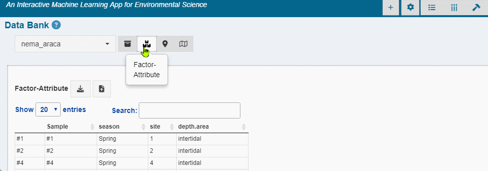{width="797"}

### Edit Datalist Columns

Edit the names of the columns (Numeric-Attribute and Factor-Attribute)

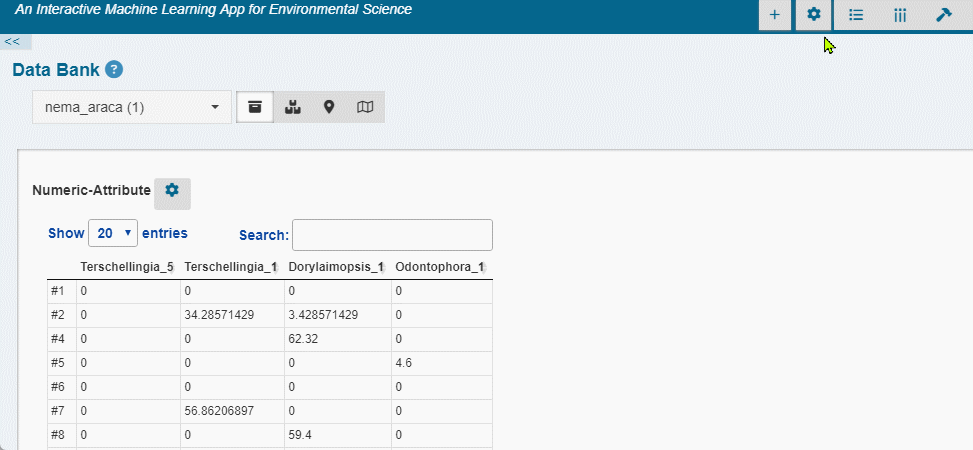{width="821"}

### Edit/Merge models

-   **To edit model names:** select the target Datalist, the model type (e.g. random forest) , enter a new name and confirm.

-   **To merge models:** select the models, and the target Datalist. The selected models are copied to the target Datalist (no models are replaced in the target Datalist). In case of duplicate model names, the application automatically renames them by adding '.1,.2, ..'.

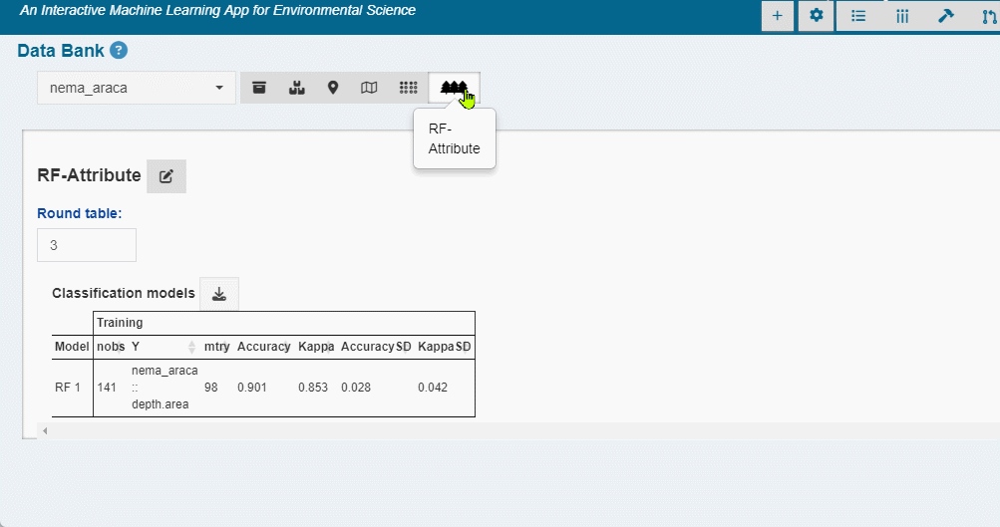{width="759"}

### Transpose Datalist

Rotate Datalist (Numeric and Factor) from rows to columns.

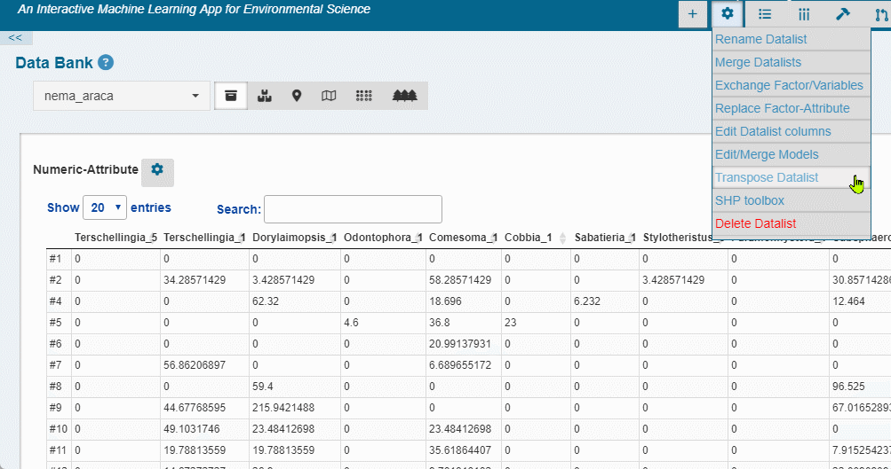{width="759"}

### SHP toolbox

Creates [Base-Shapes](#Shape), [Layer-Shapes](#Shape) and [Extra-Shape](#Shape)[s](#Extra-Shape).

1.  Upload [shape files\*] at once
2.  Select the shape attribution: Base-Shape, Layer-Shape or Extrashape
3.  Select the Target Datalist
4.  Include the shape or download a single R file to be uploaded later when creating a Datalist.

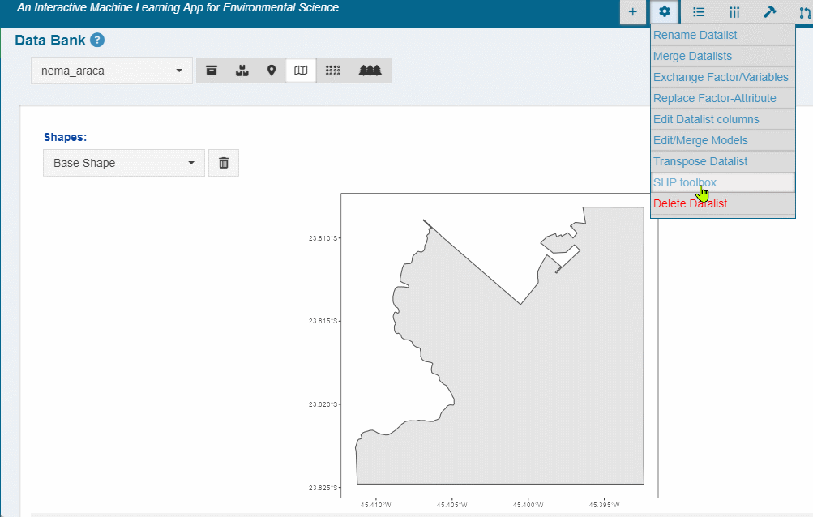{width="786"}

##### shape files\*

Shapefiles are a simple, nontopological format for storing the geometric location and attribute information of geographic features. The shapefile format defines the geometry and attributes of geographically referenced features in three or more files with specific file extensions that should be stored in the same project workspace. Requires at least three files:

-   .shp: The main file that stores the feature geometry; required.

-   .shx: The index file that stores the index of the feature geometry; required.

-   .dbf: The dBASE table that stores the attribute information of features; required.

There is a one-to-one relationship between geometry and attributes, which is based on record number. Attribute records in the dBASE file must be in the same order as records in the main file.

Each file must have the same prefix, for example, basin.shp, basin.shx, and basin.dbf

### Delete Datalists

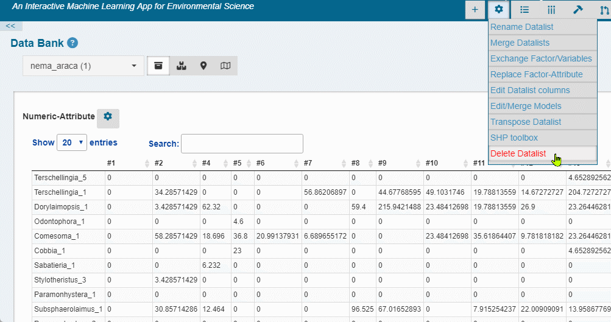{width="759"}

# Pre-processing Tools {#pre-processing-tools}

## {style="max-width: 44px; max-height: 31px" width="40"} Filter observations

::: {style="padding-left: 20px; display: flex"}
-   **Na.omit**: Check-box widget to remove all observations that contain any empty cases (NAs).

-   **Match with** : If checked, constrains the target Datalist to observations (IDs) from another Datalist.

-   **Filter by Factors:** Link to display a Filter Tree structure based on the levels of the Factor-Attribute. Click in the nodes to expand and select the factor levels. Only available for factors with less than 100 levels.

-   **Individual selection:** Link to select observations using Datalist IDs.
:::


## {style="border: 1px solid #05668D;max-width: 44px; max-height: 31px" width="40"} Filter variables

::: {style="padding-left:20px; display: flex"}
::: {style="width: 70%"}
-   **Value based removal**

    -   **Abund\<:** Remove variables with total value less than x-percent of the total.

    -   **Freq\<:** Remove variables occurring in less than x-percent of the number of observations.

    -   **Singletons:** Requires a counting data. Remove variables occurring only once.

-   **Individual Selection:** Link to select variables using columns names.
:::

::: {style="width: 30%"}

:::
:::

## {style="border: 1px solid #05668D;max-width: 44px; max-height: 31px" width="40"} Transformations

::: {style="padding-left:20px; display: flex"}
::: {style="width: 70%"}
<div>

### Transformation

-   **None**: No Transformation.

-   **Log2**: logarithmic base 2 transformation as suggested by Anderson et al. (2006): log_b (x) + 1 for x \> 0, where b is the base of the logarithm. Zeros are left as zeros. Higher bases give less weight to quantities and more to presences, and logbase = Inf gives the presence/absence scaling. Please note this is not log(x+1). Anderson et al. (2006) suggested this for their (strongly) modified Gower distance, but the standardization can be used independently of distance indices.

-   **Log10**: logarithmic base 10 transformation as suggested by Anderson et al. (2006): log_b (x) + 1 for x \> 0, where b is the base of the logarithm. Zeros are left as zeros. Higher bases give less weight to quantities and more to presences, and logbase = Inf gives the presence/absence scaling. Please note this is not log(x+1). Anderson et al. (2006) suggested this for their (strongly) modified Gower distance, but the standardization can be used independently of distance indices.

-   **Total**: divide by the line (observation) total

-   **Max**: divide by column (variable) maximum.

-   **Frequency**: divide by column (variable) total and multiply by the number of non-zero items, so that the average of non-zero entries is one.

-   **Range**: standardize column (variable) values into range 0 ... 1. If all values are constant, they will be transformed to 0.

-   **Pa**: scale x to presence/absence scale (0/1).

-   **Chi.square**: divide by row sums and square root of column sums, and adjust for square root of matrix total.

-   **Hellinger**: square root of method = total.

-   **Sqrt2**: square root.

-   **Sqrt4**: 4th root.

-   **Log2(x+1**): logarithmic base 2 transformation (x+1).

-   **Log10(x+1)**: logarithmic base 10 transformation (x+1).

-   **BoxCox**: Designed for non-negative responses. boxcox transforms nonnormally distributed data to a set of data that has approximately normal distribution. The Box-Cox transformation is a family of power transformations.

-   **Yeojohson**: Similar to the Box-Cox model but can accommodate predictors with zero and/or negative values.

-   **expoTrans**: Exponential transformation.

### Scale and Centering {data-link="Scale and Centering"}

-   **Scale**: If checked then scaling is done by dividing the (centered) columns of "x" by their standard deviations, if center is TRUE, and the root mean square otherwise.

-   **Center**: If center is checked then centering is done by subtracting the column means (omitting NAs) of "x" from their corresponding columns.

### Random Rarefraction

-   Generates one randomly rarefied community given sample size. If the sample size is equal to or larger than the observed number of individuals, the non-rarefied community will be returned.

</div>
:::

::: {style="width: 30%"}

:::
:::

## {style="border: 1px solid #05668D;max-width: 44px; max-height: 31px" width="40"} Data imputation

Methods for completing the missing values with values estimated from the observed data. This tool is only available for Datalists that contain missing data either in the Numeric-Attribute or in the Factor-Attribute. To impute missing values:

1.  Choose the Target-Attribute;

2.  Pick a Method (described below);

3.  Click in the flash blue {style="max-width: 22px; max-height: 16px" width="22"} button. The "Save Changes" dialog will automatically pop-up

4.  Save the Datalist with imputed values as a new Datalist or replace an existing one.

{width="858"}

**Methods:**

-   **Median/mode:** Numeric-Attribute columns are imputed with the median; Factor-Attribute columns are imputed with the mode

-   **Knn**: k-nearest neighbor imputation is only available for the Numeric-Attribute. It is carried out by finding the k closest samples (Euclidian distance) in the dataset. This method automatically center and scale your data.

-   **Baginpute**: Only available for the Numeric-Attribute. Imputation via bagging fits a bagged tree model for each predictor (as a function of all the others). This method is simple, more accurate and accepts missing values, but it has much higher computational cost.

-   **MedianImpute**: Only available for the Numeric-Attribute. Imputation via medians takes the median of each predictor in the training set and uses them to fill missing values. This method is simple, fast, and accepts missing values, but treats each predictor independently, and may be inaccurate.

## {style="border: 1px solid #05668D;max-width: 44px; max-height: 31px" width="40"} Data partition

::: {style="padding: 20px; display: flex"}
::: {style="width: 70%"}
Add partition as a factor in the Factor-Attribute. For the supervised ML methods, you can choose this partition to constrain training and testing data.

-   **Random Sampling:** simple random sampling is used.

-   **Balanced Sampling:** the random sampling is done within the levels of a chosen factor to balance the sampling distribution.
:::

::: {style="width:50%"}

:::
:::

In the context of Machine Learning, the split of the modelling dataset into training and testing samples is one of the most important pre-processing steps that is needed. The creation of different samples for training and testing helps the model evaluation.

## {style="border: 1px solid #05668D;max-width: 44px; max-height: 31px" width="40"} Aggregate

::: {style="padding-left: 20px; display: flex"}
::: {style="width: 70%"}
::: {style="padding: 20px"}
The process involves aggregate individual cases of the Numeric-Attribute based on a grouping variable (selected factor(s)), by means of a calculation, such as Mean, Sum, Median, Var (variance), SD (standard deviation), Min, Max.
:::
:::

::: {style="width: 100%"}

:::
:::

::: boxtext
## {style="border: 1px solid #05668D;max-width: 44px; max-height: 31px" width="40"} Create Palette

::: {style="padding-left: 20px; display: flex"}
::: {style="width: 70%"}
Create customized palettes to be used along the graphical outputs.
:::

::: {style="width: 40%"}

:::
:::
:::

## {style="border: 1px solid #05668D;max-width: 44px; max-height: 31px" width="40"} Savepoint

::: {style="padding-left: 20px; display: flex"}
::: {style="width: 70%"}
-   **Create**: create a Savepoint, which is a single R object to be downloaded and that can be reloaded later to restore analysis output.

-   **Restore** : Upload a Savepoint (.rds file) to restore the dashboard.
:::

::: {style="width: 30%"}

:::
:::

## Track changes

<div>

This group of panels shows up when using the functionalities provided by the pre-processing tool bar {style="max-width: 29px; max-height: 20px" width="29"}{style="max-width: 29px; max-height: 20px" width="29"}{style="max-width: 29px; max-height: 20px" width="29"}{style="max-width: 29px; max-height: 20px" width="29"}{style="max-width: 29px; max-height: 20px" width="29"}{style="max-width: 29px; max-height: 20px" width="29"}. The user can track changes in real-time via summary panels and histograms. We highlight the importance of the *Missing values* panel for checking the number of missing values per variable.

::: {style="display: flex"}
::: {style="width: 50%"}
-   **Changes**: displays current and previous changes (see existing)

-   **Summary**: displays the number of missing values, rows, and columns; and minimum, average, median, and maximum values.

-   **Data**: Histogram of all numerical values.

-   **colSums**: Column sum histogram.

-   **rowSums**: row sum historam.

-   **Missing values**: number of missing values per variable.
:::

::: {style="width: 50%"}

:::
:::

</div>

# Sidebar-menu

## {style="max-width: 54px; max-height: 30px" width="40"} Data Bank

::: {style="display: flex"}
::: {style="padding-left: 20px"}
{style="max-width: 54px; max-height: 30px" width="54"} **Datalist-Picker:** Drop-down selector of the target Datalist

{style="max-width: 54px; max-height: 30px" width="54"} **Numeric-Attribute:** shows the Numeric-Attribute sheet

{style="max-width: 54px; max-height: 30px" width="54"} **Factor-Attribute:** shows the Factor-Attribute sheet

{style="max-width: 54px; max-height: 30px" width="54"} **Coords-Attribute:** shows the Coords-Attribute sheet

{style="max-width: 54px; max-height: 30px" width="54"} [**Shapes**]{#Shape}**:**

-   [*Base-Shape:*]{#Base-Shape} the shape to be used to clip the geographic area (e. g., an oceanic basin shape).

-   *Layer-Shape:* the shape to be used to be used as an additional layer (e.g., a continent shape).

-   *Extra-Shapes:* Any additional shapes to be included in the Datalist (e.g., bathymetry lines).
:::

::: {style="max-width: 50%"}

:::
:::

::: {style="padding-left: 20px"}
{style="max-width: 54px; max-height: 30px" width="54"} **SOM-Attribute:** displays the summary of SOM models ([unsupervised](#self-organizing-maps) and [supervised](#self-organizing-maps-1)) (if saved in the target Datalist).

{style="max-width: 54px; max-height: 30px" width="54"} **NB-Attribute:** displays the summary of [NB models](#naive-bayes)

{style="max-width: 54px; max-height: 30px" width="54"} **KNN-Attribute:** displays the summary of [KNN models](#k-nearest-neighbor)

{style="max-width: 54px; max-height: 30px" width="54"} **SVM-Attribute:** displays the summary of [SVM models](#support-machine-vector)

{style="max-width: 54px; max-height: 30px" width="54"} **RF-Attribute:** displays the summary of [RF models](#random-forest)

{style="max-width: 54px; max-height: 30px" width="54"} **SGBOOST -Attribute:** displays the summary of [SGBOOST models](#stochastic-gradient-boosting)
:::

## {style="max-width: 54px; max-height: 30px" width="40"} Descriptive tools

### Summary

::: {style="display: flex"}
::: {style="max-width: 30%"}
-   **Data**: shows number of rows, columns, and missing values of the Numeric-Attribute.

-   **Variable**: shows summary and a histogram for each variable in the Numeric-Attribute.

-   **Factors**: shows a summary of the Factor-Attribute and stacked-plot with the count of the Factors levels.

-   **Datalist**: shows the Datalist structure.
:::

<div>

{style="padding: 20px"}

</div>
:::

### Ridges

::: {style="display: flex"}
::: {style="max-width: 30%"}
-   • Ridge plots are partially overlapping line plots that create the impression of a mountain range. They are useful for visualizing changes in distributions over a gradient. This function uses the [geom_ridgeline](https://rdrr.io/cran/ggridges/man/geom_ridgeline.html) function from the [ggridges](https://rdrr.io/cran/ggridges/) package.
:::

<div>

{style="padding: 20px"}

</div>
:::

### Scatter

::: {style="display: flex"}
::: {style="max-width: 30%"}
-   A graph in which the values of two variables are plotted along two axes, the pattern of the resulting points revealing any potential correlation present.
:::

<div>

{style="padding: 20px"}

</div>
:::

### Histogram

-   Numeric-Attribute column sum histogram.

### Boxplot

::: {style="display: flex"}
::: {style="min-width: 30%"}
-   Boxplot with numerous graphical options.
:::

<div>

{style="padding: 20px"}

</div>
:::

### Histogram

-   Numeric-Attribute column sum histogram.

### MDS

::: {style="display: flex"}
::: {style="max-width: 30%"}
-   Nonmetric Multidimensional Scaling. This functionality uses the [metaMDS](https://rdrr.io/rforge/vegan/man/metaMDS.html) function from [vegan](https://rdrr.io/rforge/vegan/) package. It uses default arguments, with user option to choose the distance metric (Bray-Curtis, Euclidean and Jacquard). The user can interact with several graphical options, including coloring observations by a factor from the associated Factor-Attribute.
:::

<div>

{style="padding: 20px"}

</div>
:::

### PCA

::: {style="display: flex"}
::: {style="max-width: 30%"}
-   Principal Component Analysis. This functionality uses the [prcomp](https://www.rdocumentation.org/packages/stats/versions/3.6.2/topics/prcomp) function from R base. We recommend scaling the data before the PCA analysis. The user can interact with several graphical options, including coloring observations by a factor from the associated Factor-Attribute.
:::

<div>

{style="padding: 20px"}

</div>
:::

### RDA

::: {style="display: flex"}
::: {style="max-width: 30%"}
Redundancy Analysis. This functionality uses the [rda](https://www.rdocumentation.org/packages/vegan/versions/2.4-2/topics/cca) function from from [vegan](https://rdrr.io/rforge/vegan/) package. It requires at least two Datalist for building a Y\~X model. The results are presented in two panels:

-   Plot with with several graphical options, such as coloring observations by a factor from the associated Factor-Attribute.

-   Summary: results of the rda model- importance (constrained and unconstrained), variable and observation scores, linear constrains and biplot.
:::

<div>

{style="padding: 20px"}

</div>
:::

### segRDA

::: {style="display: flex"}
::: {style="max-width: 30%"}
This functionality implements the [segRDA](https://besjournals.onlinelibrary.wiley.com/doi/full/10.1111/2041-210x.13300) workflow for modelling non-continuous linear responses of ecological data. The routine consists of three panels:

-   SMW - Split Moving Windows along ordered data.

-   DP: dissimilarity profile of the SMW results for identifying breakpoints.

-   pwRDA: performs a piece-wise redundancy analysis using specified breakpoints. The results are presented in the same way as in the RDA panel.
:::

<div>

{style="padding: 20px"}

</div>
:::

::: boxtext
## {style="max-width: 54px; max-height: 30px" width="40"} Spatial Tools

This module is intended for spatialization and therefore requires the Coords-Attributes attached to the chosen Datalist.

After choosing a Datalist, select the Attribute (Numeric or Variable) and then the target: Numeric/Factor. Optionally, filters can be applied to plot observations corresponding to a factor level.

Map types include discretization (2D, 3D, 4D), interpolation (2D, Surface and Stack), and rasterization (2D, Surface and Stack). A wide range of customization options is available for all map types.


### Discrete

Variable/factor are represented as symbols in the map. When the target data is a Numeric-Attribute, it is available the scale option (default), where the chosen symbol is represented as a point that varies on size and color according to the target data. Alternatively, points can be colored according to a selected factor.

The 3D/4D option is also available for this type of maps. In this option, the target variable is plotted along a Z variable, which in turn can be colored by an extra selected factor.

For discrete data, the Mantel correlogram is also available.


### Interpolation

Variable/factor are interpolated on a regular grid defined by the user.

When mapping the Numeric Attribute, the interpolation is performed using Inverse Distance Weighing (IDW), while for the Factor Attribute, it is performed using k-nearest neighbors (KNN). For both interpolation types, it is available tuning parameters.

-   IDW tuning parameters

    -   nmax

    -   nmin

    -   omax

    -   maxdist

-   KNN

    -   k - the number of neighbors considered

### Raster

Mapping is performed by simple rasterization at the coordinate's resolution. This option is only available for mapping Numeric-Attribute.

### Surface and Stack

These map types are available for Interpolated/Rasterized maps. Both options require at least two saved maps.

-   The surface maps draw a perspective plot of a surface over the coordinates plane. The surface passes through the z values corresponding to all pairs of coordinates. Additionally, the surface can be colored according to a selected factor (4D).

-   The stacked map combines multipe interploated/rasterized planes (for a common geographic area) to represent an integrated map. The collection of saved maps acts as layers in the stack, and their position along the z axis can be defined by the user.
:::

## {style="max-width: 54px; max-height: 30px" width="40"} Biodiversity Tools

### Biological Diversity Indexes

Calculates diversity metrics commonly used in ecological studies.

+-----------+-------------------------------+---------------------------------------------------------------------------------------------------------------------------------------------------------------------------------------------------------------------------------------------------------------------------------------------------------------------------------------------------------------------------------------+----------------------------------------------------------------------------------------------------------------------------------------------+
| Abrev     | Index                         | Description                                                                                                                                                                                                                                                                                                                                                                           | Formula                                                                                                                                      |
+===========+===============================+=======================================================================================================================================================================================================================================================================================================================================================================================+==============================================================================================================================================+
| N         | Abundance                     | Total number of individuals                                                                                                                                                                                                                                                                                                                                                           |                                                                                                                                              |
+-----------+-------------------------------+---------------------------------------------------------------------------------------------------------------------------------------------------------------------------------------------------------------------------------------------------------------------------------------------------------------------------------------------------------------------------------------+----------------------------------------------------------------------------------------------------------------------------------------------+
| S         | S                             | the total number of species in each observation                                                                                                                                                                                                                                                                                                                                       |                                                                                                                                              |
+-----------+-------------------------------+---------------------------------------------------------------------------------------------------------------------------------------------------------------------------------------------------------------------------------------------------------------------------------------------------------------------------------------------------------------------------------------+----------------------------------------------------------------------------------------------------------------------------------------------+
| margalef  | margalef:                     | The total number of species weighted by the logarithm of the total number of individuals                                                                                                                                                                                                                                                                                              | $$                                                                                                                                           |
|           |                               |                                                                                                                                                                                                                                                                                                                                                                                       | margalef=\frac{S-1}{lnN}                                                                                                                     |
|           |                               |                                                                                                                                                                                                                                                                                                                                                                                       | $$                                                                                                                                           |
+-----------+-------------------------------+---------------------------------------------------------------------------------------------------------------------------------------------------------------------------------------------------------------------------------------------------------------------------------------------------------------------------------------------------------------------------------------+----------------------------------------------------------------------------------------------------------------------------------------------+
| D         | Simpsom diversity             | the probability that two individuals drawn at random from an infinite community would belong to the same species                                                                                                                                                                                                                                                                      | $$                                                                                                                                           |
|           |                               |                                                                                                                                                                                                                                                                                                                                                                                       | D=\sum{p^2}                                                                                                                                  |
|           |                               |                                                                                                                                                                                                                                                                                                                                                                                       | $$                                                                                                                                           |
+-----------+-------------------------------+---------------------------------------------------------------------------------------------------------------------------------------------------------------------------------------------------------------------------------------------------------------------------------------------------------------------------------------------------------------------------------------+----------------------------------------------------------------------------------------------------------------------------------------------+
| H         | H. Shannon diversity          | This index considers both species richness and evenness. The uncertainty is measured by the Shannon Function 'H'. This term is the measure corresponding to the entropy concept defined by                                                                                                                                                                                            | $$                                                                                                                                           |
|           |                               |                                                                                                                                                                                                                                                                                                                                                                                       | H=\sum_{n = 1}^{n}{(p_i * lnp_i)}                                                                                                            |
|           |                               |                                                                                                                                                                                                                                                                                                                                                                                       | $$                                                                                                                                           |
+-----------+-------------------------------+---------------------------------------------------------------------------------------------------------------------------------------------------------------------------------------------------------------------------------------------------------------------------------------------------------------------------------------------------------------------------------------+----------------------------------------------------------------------------------------------------------------------------------------------+
| H~log2~   |                               | This term is the measure corresponding to the entropy concept defined by:                                                                                                                                                                                                                                                                                                             | ::: formula                                                                                                                                  |
|           |                               |                                                                                                                                                                                                                                                                                                                                                                                       | $$   H_{log_2}=\sum_{n = 1}^{n}{(p_i * log_2p_i)}   $$                                                                                       |
|           |                               |                                                                                                                                                                                                                                                                                                                                                                                       | :::                                                                                                                                          |
+-----------+-------------------------------+---------------------------------------------------------------------------------------------------------------------------------------------------------------------------------------------------------------------------------------------------------------------------------------------------------------------------------------------------------------------------------------+----------------------------------------------------------------------------------------------------------------------------------------------+
| H~log10~  | Shannon Function H on base 10 | This term is the measure corresponding to the entropy concept defied by:                                                                                                                                                                                                                                                                                                              | $$                                                                                                                                           |
|           |                               |                                                                                                                                                                                                                                                                                                                                                                                       | H_{log_{10}}=\sum_{n = 1}^{n}{(p_i * log_{10}p_i)}                                                                                           |
|           |                               |                                                                                                                                                                                                                                                                                                                                                                                       | $$                                                                                                                                           |
+-----------+-------------------------------+---------------------------------------------------------------------------------------------------------------------------------------------------------------------------------------------------------------------------------------------------------------------------------------------------------------------------------------------------------------------------------------+----------------------------------------------------------------------------------------------------------------------------------------------+
| J         | Evenness                      | Measure of how different the abundances of the species in a community are from each other. The Shannon evennes is defined by:                                                                                                                                                                                                                                                         | $$                                                                                                                                           |
|           |                               |                                                                                                                                                                                                                                                                                                                                                                                       |  J=\frac{H}{ln(S)}                                                                                                                           |
|           |                               |                                                                                                                                                                                                                                                                                                                                                                                       | $$                                                                                                                                           |
+-----------+-------------------------------+---------------------------------------------------------------------------------------------------------------------------------------------------------------------------------------------------------------------------------------------------------------------------------------------------------------------------------------------------------------------------------------+----------------------------------------------------------------------------------------------------------------------------------------------+
| DOM~rel~  | Relative dominance            | A simple measure of dominance where Ni , the abundance of the most abundant species is divided by N:                                                                                                                                                                                                                                                                                  | $$                                                                                                                                           |
|           |                               |                                                                                                                                                                                                                                                                                                                                                                                       | Dom_{rel}=\frac{N_1}{N}                                                                                                                      |
|           |                               |                                                                                                                                                                                                                                                                                                                                                                                       | $$                                                                                                                                           |
+-----------+-------------------------------+---------------------------------------------------------------------------------------------------------------------------------------------------------------------------------------------------------------------------------------------------------------------------------------------------------------------------------------------------------------------------------------+----------------------------------------------------------------------------------------------------------------------------------------------+
| Log~skew~ | Skewness                      | The third moment of a probability distribution, measuring asymmetry. Right skew (positive numbers) indicates more probability on the right (abundant) side. Left skew (negative numbers) indicates more probability on the left side. All species abundance distributions are strongly right skewed on an arithmetic scale, so the more interesting measure is skew on the log scale: | $$                                                                                                                                           |
|           |                               |                                                                                                                                                                                                                                                                                                                                                                                       | LogSkew = \frac{\sum {\frac{(log(n_i)-\mu)^3}{S}}}{[\sum {\frac{(log(n_i)-\mu)^2}{S}}]^\frac{3}{2} \frac{S}{(S-2)} \sqrt{[\frac{(S-1)}{S}]}} |
|           |                               |                                                                                                                                                                                                                                                                                                                                                                                       | $$                                                                                                                                           |
+-----------+-------------------------------+---------------------------------------------------------------------------------------------------------------------------------------------------------------------------------------------------------------------------------------------------------------------------------------------------------------------------------------------------------------------------------------+----------------------------------------------------------------------------------------------------------------------------------------------+

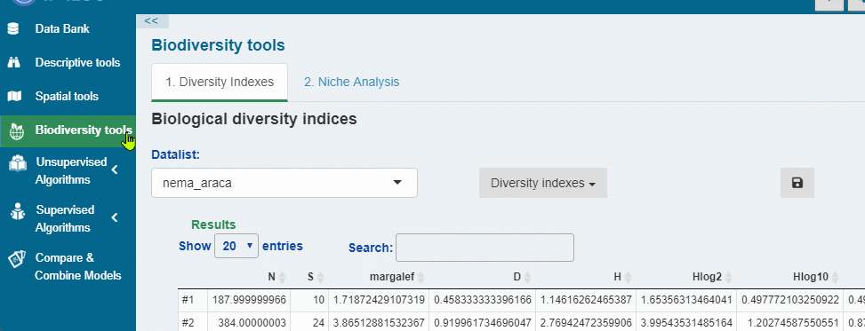

### Niche Analysis

This analysis implemented with the `niche` function from the [ade4](https://cran.r-project.org/web/packages/ade4/index.html) package (Dray and Dufour, 2007). It consists of running a principal component analysis (PCA) on the environmental table and associating the resulting table of row profiles with the respective faunistic table, therefore giving the average position (i.e., niche position) of each species along the ordination axes. The OMI analysis also provides a niche breadth value, which represents the total variance of the environmental table weighted by the species' abundances.

The OMI analysis is also used to obtain the niche position (NP), environmental boundaries (EBs) and niche breadths (NBs) of species along the principal components (Vieira & Fonseca, 2019).

More details about the niche parameters calculation are available in Dolédec et al. (2000).

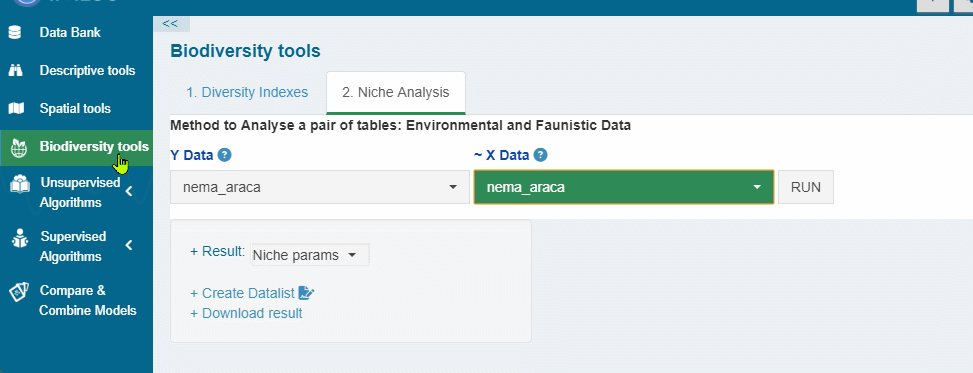

## {style="max-width: 54px; max-height: 30px" width="40"} Unsupervised Algorithms

### {style="max-width: 54px; max-height: 30px" width="40"} Self-Organizing maps {#self-organizing-maps}

Self-organizing maps (SOMs) is an unsupervised competitive learning method (Kohonen, 2001). The application of SOMs can be thought as a data reduction procedure which aggregates similar data in map units (Best-mathing units - BMUs). BMUs are not the means, or medians, of group of samples, but the results of a learning phase, so that data patterns and features are extracted by modeling, rather than by 'simply' averaging, or linearly projecting on reduced subspaces, data (Liu et al., 2006)

This analysis is based on the kohonen R package.

The SOM module is organized into 3 panels: Training, Results and Predict.

#### 1. Training

+--------------------------------------------------------------------------------------------------------------------------------------------------------------------------+-------------------------------------------------------------------------------------------------------------------------------------------------------------------------------------------------------------------------------------------------------------------------------------------------+
| ::: ctab                                                                                                                                                                 | ::: ctab                                                                                                                                                                                                                                                                                        |
| 1\. Set the grid                                                                                                                                                         | 2\. Set the training parameters                                                                                                                                                                                                                                                                 |
| :::                                                                                                                                                                      | :::                                                                                                                                                                                                                                                                                             |
+==========================================================================================================================================================================+=================================================================================================================================================================================================================================================================================================+
| Set the grid of units, of a specified size and topology. The app automatically determines the grid size (xdim, ydim) via the [Suggested topology\*](#suggested-topology) | Set the training parameters of SOM:                                                                                                                                                                                                                                                             |
|                                                                                                                                                                          |                                                                                                                                                                                                                                                                                                 |
| -   **xdim, ydim**: dimensions of the grid                                                                                                                               | -   **dist.fcts**: Distance measure between each neuron and input data.                                                                                                                                                                                                                         |
|                                                                                                                                                                          |                                                                                                                                                                                                                                                                                                 |
| -   **topo**: choose between a hexagonal or rectangular topology                                                                                                         | -   **rlen**: the number of times the complete dataset will be presented to the network.                                                                                                                                                                                                        |
|                                                                                                                                                                          |                                                                                                                                                                                                                                                                                                 |
| -   **neighbourhood.fct**: choose between bubble and gaussian neighbourhoods when training a SOM                                                                         | -   **seed**: A numeric value. If supplied it ensure that you get the same result if you start with the same seed.                                                                                                                                                                              |
|                                                                                                                                                                          |                                                                                                                                                                                                                                                                                                 |
| -   toroidal: whether the grid is toroidal or not.                                                                                                                       | -   **Fine tuning**:                                                                                                                                                                                                                                                                            |
|                                                                                                                                                                          |                                                                                                                                                                                                                                                                                                 |
|                                                                                                                                                                          |     -   **a1,a2**: Learning rate, numbers indicating the amount of change. Default is to decline linearly from 0.05 to 0.01 over rlen updates. Not used for the batch algorithm.                                                                                                                |
|                                                                                                                                                                          |                                                                                                                                                                                                                                                                                                 |
|                                                                                                                                                                          |     -   **r1,r2**: the radius of the neighbourhood, either given as a single number or a vector (start, stop). If it is given as a single number the radius will change linearly from radius to zero; as soon as the neighbourhood gets smaller than one only the winning unit will be updated. |
|                                                                                                                                                                          |                                                                                                                                                                                                                                                                                                 |
|                                                                                                                                                                          | -   **mode**: type of learning algorithm.                                                                                                                                                                                                                                                       |
|                                                                                                                                                                          |                                                                                                                                                                                                                                                                                                 |
|                                                                                                                                                                          | -   **maxNA.fraction**: the maximal fraction of values that may be NA to prevent the row to be removed                                                                                                                                                                                          |
+--------------------------------------------------------------------------------------------------------------------------------------------------------------------------+-------------------------------------------------------------------------------------------------------------------------------------------------------------------------------------------------------------------------------------------------------------------------------------------------+

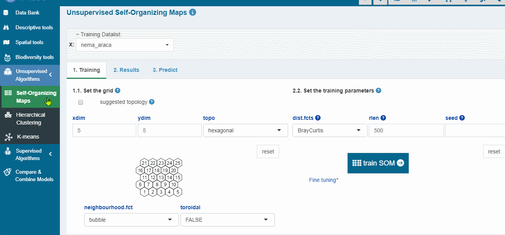

##### Suggested topology\* {#suggested-topology}

Checkbox to automatically calculate the the number of map nodes and the side length ratio as follows (Vesanto, 2000 ):

1.  Determine the number of map nodes using the heuristic recommendation, $$
    M=5\sqrt{N}
    $$where N is the number of observations in the input data set ( Vesanto, 2000 )

2.  Determine the eigenvectors and eigenvalues in the data from the autocorrelation matrix

3.  Set the ratio between the two sides of the grid equivalent to the ratio between the two largest eigenvalues, and

4.  Scale the side lengths so that their product (xdim \* ydim) is as close as possible to the number of map units determined above.

#### 2. Results

+---------------------+--------------------------------------------------------------------------------------------------------------------------------------------------------------------------------------------------------------------------------------------------------+
| ::: ctab            | ::: ctab                                                                                                                                                                                                                                               |
| **2.1. Parameters** | Displays a sheet with the quality measures and the training parameters. Downloads are available for the sheet (.csv and .xlsx) and the model (.rds file).                                                                                              |
| :::                 | :::                                                                                                                                                                                                                                                    |
+---------------------+--------------------------------------------------------------------------------------------------------------------------------------------------------------------------------------------------------------------------------------------------------+
| ::: ctab            | ::: ctab                                                                                                                                                                                                                                               |
| **2.2. Changes**    | plot showing the mean distance to the closest codebook vector during training.                                                                                                                                                                         |
| :::                 | :::                                                                                                                                                                                                                                                    |
+---------------------+--------------------------------------------------------------------------------------------------------------------------------------------------------------------------------------------------------------------------------------------------------+
| ::: ctab            | ::: ctab                                                                                                                                                                                                                                               |
| **2.3. Couting**    | plot showing the number of objects mapped to the individual units. Empty units are depicted in gray.                                                                                                                                                   |
| :::                 | :::                                                                                                                                                                                                                                                    |
+---------------------+--------------------------------------------------------------------------------------------------------------------------------------------------------------------------------------------------------------------------------------------------------+
| ::: {style="ctab"}  | ::: ctab                                                                                                                                                                                                                                               |
| **2.4. Umatrix**    | shows the sum of the distances to all immediate neighbours. Units near a class boundary can be expected to have higher average distances to their neighbors.                                                                                           |
| :::                 | :::                                                                                                                                                                                                                                                    |
+---------------------+--------------------------------------------------------------------------------------------------------------------------------------------------------------------------------------------------------------------------------------------------------+
| ::: ctab            | ::: ctab                                                                                                                                                                                                                                               |
| **2.5. BMUs**       | Plot that shows where observations are mapped and the influence of the variables ([Variable factor map\*]). Several graphical options are available for the plot.                                                                                      |
| :::                 | :::                                                                                                                                                                                                                                                    |
+---------------------+--------------------------------------------------------------------------------------------------------------------------------------------------------------------------------------------------------------------------------------------------------+
| ::: ctab            | ::: {style="ctab"}                                                                                                                                                                                                                                     |
| **2.6. Property**   | Properties of each unit can be calculated and shown in colour code. It can be used to visualise the similarity of one particular variable to all units in the map, to show the mean similarity of all units and the variable mapped to them, etcetera. |
| :::                 | :::                                                                                                                                                                                                                                                    |
+---------------------+--------------------------------------------------------------------------------------------------------------------------------------------------------------------------------------------------------------------------------------------------------+

##### Quality measures\*

Metrics calculated using the `aweSOM` package (Boelaert J., et. al, 2022).

+--------------------------------------+----------------------------------------------------------------------------------------------------------------------------------------------------------------------------------------------------------------------------------------------------------------------------------------------------------------------------------------------------------------------------------------------------------------------------------+
| **Quantization error**               | Average squared distance between the data points and the map prototypes to which they are mapped. Lower is better.                                                                                                                                                                                                                                                                                                               |
+--------------------------------------+----------------------------------------------------------------------------------------------------------------------------------------------------------------------------------------------------------------------------------------------------------------------------------------------------------------------------------------------------------------------------------------------------------------------------------+
| **Percentage of explained variance** | Similar to other clustering methods, the share of total variance that is explained by the clustering (equal to 1 minus the ratio of quantization error to total variance). Higher is better.                                                                                                                                                                                                                                     |
+--------------------------------------+----------------------------------------------------------------------------------------------------------------------------------------------------------------------------------------------------------------------------------------------------------------------------------------------------------------------------------------------------------------------------------------------------------------------------------+
| **Topographic error**                | Measures how well the topographic structure of the data is preserved on the map. It is computed as the share of observations for which the best-matching node is not a neighbor of the second-best matching node on the map. Lower is better: 0 indicates excellent topographic representation (all best and second-best matching nodes are neighbors), 1 is the maximum error (best and second-best nodes are never neighbors). |
+--------------------------------------+----------------------------------------------------------------------------------------------------------------------------------------------------------------------------------------------------------------------------------------------------------------------------------------------------------------------------------------------------------------------------------------------------------------------------------+
| **Kaski-Lagus error**                | Combines aspects of the quantization and topographic error. It is the sum of the mean distance between points and their best-matching prototypes, and of the mean geodesic distance (pairwise prototype distances following the SOM grid) between the points and their second-best matching prototype.                                                                                                                           |
+--------------------------------------+----------------------------------------------------------------------------------------------------------------------------------------------------------------------------------------------------------------------------------------------------------------------------------------------------------------------------------------------------------------------------------------------------------------------------------+
| **Neuron Utilization**               | The percentage of neurons that are not BMU of any observation                                                                                                                                                                                                                                                                                                                                                                    |
+--------------------------------------+----------------------------------------------------------------------------------------------------------------------------------------------------------------------------------------------------------------------------------------------------------------------------------------------------------------------------------------------------------------------------------------------------------------------------------+

##### Variable factor map\*

The chart is very similar to the variable factor map obtained from the principal component analysis (PCA). It calculates the weighted correlation for each variable using the coordinates (x, y) of the neurons and their weights (number of instances). The codebooks vectors of the cells correspond to an estimation of the conditional averages, calculating their variance for each variable is equivalent to estimating the between-node variance of the variable, and hence their relevance.

The `most important correlations` option returns npic variables with the highest variance, whereas `clock-wise correlations` returns npic variables with the highest correlation considering along the different directions of the codebook.

#### 3. Predict

+------------------------------------------------------------------------------------------------------------------------------------------------------------------------------------------------------------+-----------------------------------------------------------------------------------------------------------------------+
| **3.1 Results:**                                                                                                                                                                                           | ::: {style="min-width: 600px"}                                                                                        |
|                                                                                                                                                                                                            | -   **Data predictions:** predicted values for the training data.                                                     |
| ::: {style="max-width: 200px"}                                                                                                                                                                             |                                                                                                                       |
| Displays several prediction results, which can be downloaded as *.csv* or .*xlsx* file. For the options *Data predictions* and *Obs errors (X)*, is also possible to create a Datalist from these results. | -   **Obs errors (X):** Root-mean square (RMSE), R-squared and Mean Absolute error (MAE) per observation.             |
| :::                                                                                                                                                                                                        |                                                                                                                       |
|                                                                                                                                                                                                            | -   **Var errors (X):** RMSE, R-squared and MAE per variable.                                                         |
|                                                                                                                                                                                                            |                                                                                                                       |
|                                                                                                                                                                                                            | -   **BMUs:** unit numbers to which newdata observations are mapped.                                                  |
|                                                                                                                                                                                                            |                                                                                                                       |
|                                                                                                                                                                                                            | -   **Neuron Prediction:** prediction values associated with map units                                                |
|                                                                                                                                                                                                            |                                                                                                                       |
|                                                                                                                                                                                                            | -   **Quality measures:** Computes several quality measures on a trained SOM.                                         |
|                                                                                                                                                                                                            | :::                                                                                                                   |
+------------------------------------------------------------------------------------------------------------------------------------------------------------------------------------------------------------+-----------------------------------------------------------------------------------------------------------------------+
| ::: cmap                                                                                                                                                                                                   | ::: cmap                                                                                                              |
| **3.2. BMUs**                                                                                                                                                                                              | Plot showing where the observations and predictions are mapped. Several graphical options are available for the plot. |
| :::                                                                                                                                                                                                        | :::                                                                                                                   |
+------------------------------------------------------------------------------------------------------------------------------------------------------------------------------------------------------------+-----------------------------------------------------------------------------------------------------------------------+
| ::: {style="cmap"}                                                                                                                                                                                         | ::: cmap                                                                                                              |
| **3.3. Property**                                                                                                                                                                                          | Plot showing the similarity of one particular predicted variable to all units in the map.                             |
| :::                                                                                                                                                                                                        | :::                                                                                                                   |
+------------------------------------------------------------------------------------------------------------------------------------------------------------------------------------------------------------+-----------------------------------------------------------------------------------------------------------------------+

### {style="max-width: 54px; max-height: 30px" width="40"} Hierarchical clustering

Hierarchical cluster analysis on the Numeric-Attribute or SOM-codebook (if any saved som model). Initially, each object is assigned to its own cluster and then the algorithm proceeds iteratively, at each stage joining the two most similar clusters, continuing until there is just a single cluster. At each stage distances between clusters are recomputed by the Lance--Williams dissimilarity update formula according to the particular clustering method being used.

-   **Distance:** Distance measure to be used (when clustering target is Numeric-Attribute\*)

-   **Method:** The agglomeration method to be used:

    -   **Ward:** Minimizes within cluster variance (sum of errors). Clusters are combined according to smallest between cluster distance.

    -   **Ward.D2:** Same as ward.D, but the differences are squared (sum of squared errors).

    -   **Complete:** Measures the distance between the two most distant points in each cluster.

    -   **Single:** Measures the distance between the two closest points in each cluster.

    -   **Average**: Measures the average (mean) distance between each observation in each cluster, weighted by the number of observations in each cluster.

    -   **mMquitty**: Similar to average, but does not take number of points in the cluster into account.

    -   **Median**: Measures the median distance between each cluster's median point.

    -   **Centroid**: Measures the distance between the center of each cluster.

\**when the clustering target is the SOM codebook, the distance metric is set to the one used when training the SOM.*

+----------------------------------+--------------------------------------------------------------------------------------------------------------------------------------------------------------------------------------------------------------------------------------------------------------------------------------------------+
| ::: ctab                         | ::: ctab                                                                                                                                                                                                                                                                                         |
| 1.  **Dendogram**                | Dendogram result                                                                                                                                                                                                                                                                                 |
| :::                              | :::                                                                                                                                                                                                                                                                                              |
+==================================+==================================================================================================================================================================================================================================================================================================+
| ::: ctab                         | ::: ctab                                                                                                                                                                                                                                                                                         |
| 2.  **Scree plot**               | The scree plot panel helps you to determine the optimal number of clusters. It is a heuristic graphic method that consists of:                                                                                                                                                                   |
| :::                              |                                                                                                                                                                                                                                                                                                  |
|                                  | 1.  Plotting an internal measure of the clustering performace againt the number of clusters and                                                                                                                                                                                                  |
|                                  |                                                                                                                                                                                                                                                                                                  |
|                                  | 2.  Inspecting the shape of the resulting curve in order to detect the point at which the curve changes drastically.                                                                                                                                                                             |
|                                  |                                                                                                                                                                                                                                                                                                  |
|                                  | Generally, you want to choose a number of clusters so that adding another cluster doesn't improve much better the internal measure of the clustering performace (i.e the steep slope).                                                                                                           |
|                                  |                                                                                                                                                                                                                                                                                                  |
|                                  | Finding the 'elbow' may not be intuitive. So, the user can apply the split moving window analysis , which may help to identify the break in the elbow relationship. The split moving window analysis toolbox appears once the scree plot is generated and helds more details about this analyis. |
|                                  | :::                                                                                                                                                                                                                                                                                              |
+----------------------------------+--------------------------------------------------------------------------------------------------------------------------------------------------------------------------------------------------------------------------------------------------------------------------------------------------+
| ::: ctab                         | ::: ctab                                                                                                                                                                                                                                                                                         |
| 3.  **Cut Dendogram**            | generates the cluster assignement of the observations after cutting the tree.\                                                                                                                                                                                                                   |
| :::                              | A save flashing blue button allows to save the clusters assignments in the Factor-Attribute of the current Datalist.                                                                                                                                                                             |
|                                  | :::                                                                                                                                                                                                                                                                                              |
+----------------------------------+--------------------------------------------------------------------------------------------------------------------------------------------------------------------------------------------------------------------------------------------------------------------------------------------------+
| ::: ctab                         | ::: ctab                                                                                                                                                                                                                                                                                         |
| 4.  **Codebook clusters**        | Plot for mapping the training data and visualizing which SOM units would be clustered together.                                                                                                                                                                                                  |
| :::                              | :::                                                                                                                                                                                                                                                                                              |
+----------------------------------+--------------------------------------------------------------------------------------------------------------------------------------------------------------------------------------------------------------------------------------------------------------------------------------------------+
| ::: ctab                         | ::: ctab                                                                                                                                                                                                                                                                                         |
| 5.  **Map new data on codebook** | Plot for mapping new data and visualizing which SOM units would be clustered together. It also displays a selected quality measure (e.g., topographic error) of the SOM per cluster.                                                                                                             |
| :::                              | :::                                                                                                                                                                                                                                                                                              |
+----------------------------------+--------------------------------------------------------------------------------------------------------------------------------------------------------------------------------------------------------------------------------------------------------------------------------------------------+
| ::: ctab                         | ::: ctab                                                                                                                                                                                                                                                                                         |
| 6.  **Codebook screeplot**       | Generates a scree plot using a SOM [Quality measures\*] as metric.                                                                                                                                                                                                                               |
| :::                              | :::                                                                                                                                                                                                                                                                                              |
+----------------------------------+--------------------------------------------------------------------------------------------------------------------------------------------------------------------------------------------------------------------------------------------------------------------------------------------------+

## {style="max-width: 54px; max-height: 30px" width="40"} K-means

under construction............

## {style="max-width: 54px; max-height: 30px" width="40"} Supervised Algorithms

## {style="max-width: 54px; max-height: 30px" width="40"} Naive Bayes {#naive-bayes}

under construction............

## {style="max-width: 54px; max-height: 30px" width="40"} Support Machine Vector {#support-machine-vector}

under construction............

## {style="max-width: 54px; max-height: 30px" width="40"} K-Nearest neighbor {#k-nearest-neighbor}

under construction............

## {style="max-width: 54px; max-height: 30px" width="40"} Random Forest {#random-forest}

under construction............

## {style="max-width: 54px; max-height: 30px" width="40"} Stochastic Gradient Boosting {#stochastic-gradient-boosting}

under construction............

## {style="max-width: 54px; max-height: 30px" width="40"} Self-Organizing Maps {#self-organizing-maps-1}

under construction............

## {style="max-width: 54px; max-height: 30px" width="40"} Compare and Combine Models

under construction............

Compare

Combine

# Workflow examples

under construction............
